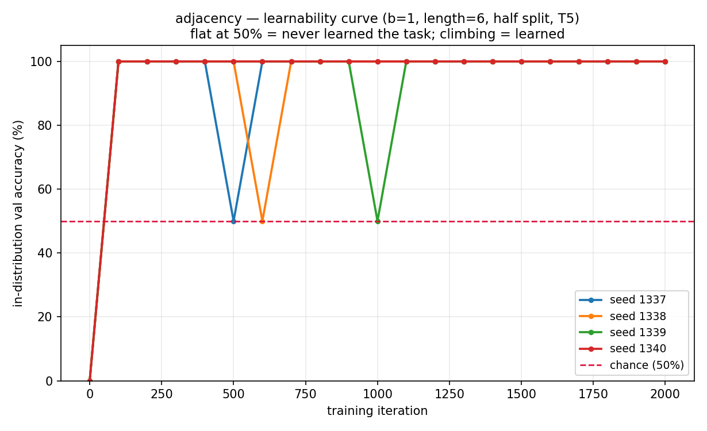
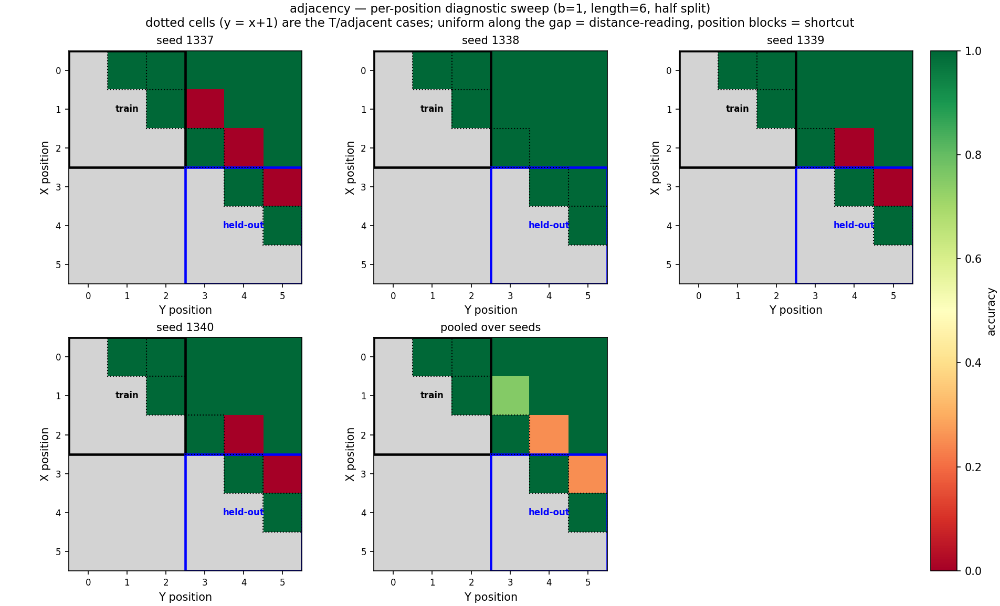

# Adjacency — Stage 1: does the setup work at all? (length 6, b=1, T5)

*2026-07-18 · commit `145b254` · John Lee*

> **Main takeaway.** T5 **learns** the task instantly (val 100% by iter ~100) but **held-out
> accuracy is bimodal across seeds: 100 / 50 / 50 / 50%.** The cause is not T5 and not the
> background — it is that **length 6 with a half split is a degenerate measurement**. Each
> half holds only 3 positions, so the training region contains exactly *one* F configuration
> and the held-out region's only F configuration is the same gap-2 case. All four seeds
> demonstrably read the **gap** (relative distance), not position. **Stage 2's b sweep should
> be run at length 10–12, not at length 6.**

### The task

Fixed-length string with `X` once and `Y` once, X always left of Y, all other slots
background; answer token last. **`T` iff `Y` is immediately after `X` (gap 1), else `F`.**

```
XY0000:T    (X@0 Y@1, adjacent)        X0Y000:F    (X@0 Y@2, gap)
```

`b` = number of distinct background token types (b=1 → background is all `0`).
`t5` = T5 relative position bias (Raffel et al. 2020), the only PE under test here.

---

## Setup

- **data / split:** length 6, b=1 (background `{0}`); `half` split — train/val put both X and
  Y in positions 0–2, held-out test puts both in 3–5. 20 000 train / 2 000 val / 2 000 test,
  50/50 T/F in every pool; chance = 50%.
- **configuration coverage (the crux):** a 3-position half admits only **3** configurations —
  2 adjacent (T) and **1** gap (F). Train region: `(0,1)T`, `(1,2)T`, `(0,2)F`. Held-out
  region: `(3,4)T`, `(4,5)T`, `(3,5)F`. At b=1 the whole training set is **3 distinct
  strings**.
- **model / config:** `n_layer=3`, `n_head=2`, `n_embd=32`, `block_size=8`, **38 464 params**;
  `pos_type=t5`, causal. AdamW, lr 1e-3 cosine → 1e-4, warmup 100, batch 64, 2000 iters, CPU.
- **seeds:** 1337–1340 (init + batch order only; the data split is fixed per b).
  *The spec called for 1 seed at Stage 1; seed 1337 failed, so 3 more were run to establish
  whether the failure was seed-specific. It is.*
- **env:** python 3.9.6 · torch 2.8.0 · numpy 2.0.2 · matplotlib 3.9.4; data `SEED=1337`.
- **reproduce:**
  ```bash
  ../venv/bin/python data/adjacent/prepare.py --b=1
  for s in 1337 1338 1339 1340; do
    ../venv/bin/python train.py    config/basic.py --seed=$s
    ../venv/bin/python evaluate.py config/basic.py --seed=$s
  done
  ../venv/bin/python plot.py --curve --b=1 --length=6 --split=half \
      --out_dir=log/figures --out_name=stage1_learnability_b1.png
  ../venv/bin/python plot.py --split=half --b=1 --out_dir=log/figures
  ```

---

## Results

**Length 6, `half` split, b=1** — per-class accuracy is what exposes the failure mode:

| seed | val (in-dist) | held-out **T** (adjacent) | held-out **F** (gap) | held-out overall |
|---|---|---|---|---|
| 1337 | 100% | 100% | **0%** | **50.00%** |
| 1338 | 100% | 100% | 100% | **100.00%** |
| 1339 | 100% | 100% | **0%** | **50.00%** |
| 1340 | 100% | 100% | **0%** | **50.00%** |

Three of four seeds answer `T` on every held-out example. Since the held-out pool is
class-balanced by construction, that lands exactly at chance — 50% here means *collapsed to
one label*, not *half right*.

**Controls:**

| condition | seeds | held-out |
|---|---|---|
| length 6, **`none`** split (full distribution), b=1 | 1337–1340 | **100% on 4/4** |
| **length 12**, `half` split, b=1 | 1337–1340 | **90 / 100 / 95 / 85%** (mean 92.5%) |

So the model, the engine, and T5 all handle adjacency fine. Only the *length-6 half split*
produces the coin flip.

**Figures** (from `results.csv` / `predictions.csv` / `curves.csv` via `plot.py`):





---

## Why / interpretation

The per-position sweep answers this precisely. Fraction of examples predicted `T`, by gap
(gold: gap 1 → T, gap ≥ 2 → F), pooled over all positions including untrained ones:

| seed | gap 1 | gap 2 | gap 3 | gap 4 | gap 5 |
|---|---|---|---|---|---|
| 1337 | 1.00 | 0.75 | 0.00 | 0.00 | 0.00 |
| 1338 | 1.00 | 0.00 | 0.00 | 0.00 | 0.00 |
| 1339 | 1.00 | 0.50 | 0.00 | 0.00 | 0.00 |
| 1340 | 1.00 | 0.50 | 0.00 | 0.00 | 0.00 |

Two things follow, and they matter more than the headline number:

1. **T5 is reading relative distance, not position — no shortcut.** Every seed answers `F` on
   *every* gap-3/4/5 configuration, including position pairs never seen in training, and `T`
   on every gap-1 pair. Accuracy is constant along constant-gap diagonals, which is the
   distance signature the spec said to look for; there are no position blocks. The shortcut
   the spec flagged as a risk **did not occur** — consistent with T5's bias being relative and
   gap 1 being its finest bucket.

2. **The whole result rides on one under-determined decision: gap 2 → F.** In the training
   region gap 2 occurs in exactly *one* configuration, `X@0,Y@2`. All four seeds get that
   specific configuration right (0/40 predicted T). They differ only on whether "gap 2 → F"
   *transfers* to the other gap-2 placements — and the held-out region's only F case is
   `X@3,Y@5`, a gap-2 placement. So held-out F accuracy, and therefore the entire held-out
   score, is decided by a single generalization step supported by a single training example.
   Whether a seed takes that step is effectively a lottery (1/4 here).

The training region simply does not identify the rule: `"gap = 1"`, `"gap ≤ 2 except X@0,Y@2"`,
and several position rules all fit those 3 configurations perfectly. No model can be expected
to pick the intended one reliably, and **which one it picks is what the length-6 half split
measures** — not background sensitivity.

The length-12 control confirms this (**hypothesis → confirmed**): a 6-position half admits
gaps 1–5 across 15 configurations (5 T, 10 F spanning four distinct gap values), the rule is
identified, and held-out accuracy rises to 85–100% with no bimodal collapse. The residual
errors there are still gap-2 cells, at the far end of the held-out region — the same
fragility, now a minor effect rather than the whole signal.

## Consequence for the experiment plan

**Stage 2's b sweep must not be run at length 6.** Its held-out metric is dominated by one
fragile configuration and is bimodal across seeds, so it has no resolution left to show a
background effect: a drop from b=1 to b=10 would be indistinguishable from the seed lottery.
The spec's staging (Stage 2 b-sweep at length 6, then Stage 3 length scaling) should be
**inverted for this task** — scale length first, then sweep b at length 10–12.

This does not invalidate the spec's reasoning; the small-halves caveat was anticipated there
("expected and fine … a small count here is normal"). What the run adds is that the small
count is not merely a coverage cosmetic — it removes the measurement's ability to answer the
question being asked.

## Caveats / limitations

- 4 seeds; with a bimodal 50/100 outcome, the "1 in 4 generalize" rate is a very rough
  estimate (a 95% interval on 1/4 spans roughly 1–70%). The qualitative bimodality is solid;
  the *rate* is not.
- One fixed data split per (b, seed) — seeds vary initialization and batch order only, so the
  variance reported here understates true run-to-run variance.
- The length-12 control is 4 seeds at b=1 only; it establishes that the degeneracy is the
  cause, not that length 12 is the right operating point for the whole sweep.
- Val accuracy is saturated (100% everywhere), so it carries no information at this stage
  beyond "learning is not the bottleneck".

## Next

1. Re-run Stage 1's gate at **length 12** (`--block_size=14`) as the new anchor, with 10+
   seeds to get an honest variance on held-out.
2. Then run the **b sweep at length 12**, b = 1…10, 10+ seeds per b — the configuration that
   can actually resolve a background effect.
3. Keep the per-position heatmap in the loop at each b: the gap-vs-position diagnostic is
   what would catch a shortcut appearing at high b, which is exactly where one would expect
   background noise to push the model toward one.
