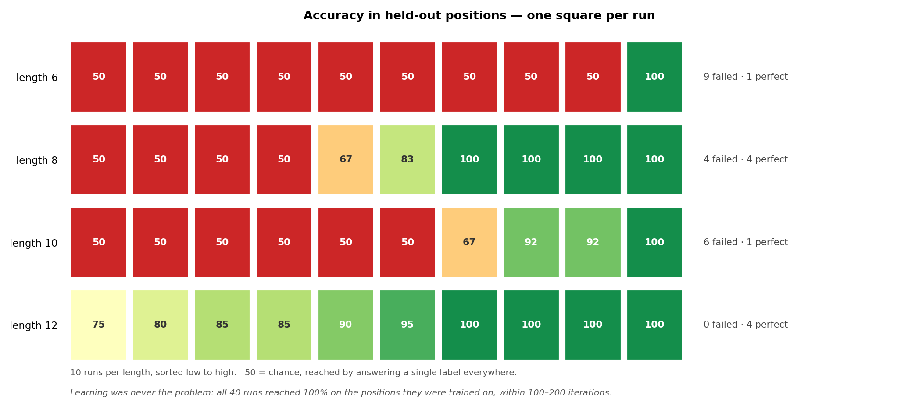

# Background-token diversity — Stage 1: the clean-background baseline (b=1, T5)

*2026-07-18 · John Lee · code, data and figures are committed together with this log*

> **Short version.** The model learns the task every time, but carries it to held-out positions
> only unreliably. At length 6, **9 of 10 runs fail completely.** Longer inputs remove that
> complete failure — at length 12 **no run collapses** and the worst is 75% — but only **4 of
> 10** are fully correct. **Stage 1 does not pass**, so the background sweep it was meant to set
> up has not been started.

| | length 6 | length 8 | length 10 | length 12 |
|---|---|---|---|---|
| learned the task (val) | 10/10 | 10/10 | 10/10 | 10/10 |
| **failed completely** | **9/10** | 4/10 | 6/10 | **0/10** |
| **fully correct** | 1/10 | 4/10 | 1/10 | **4/10** |

---

## What this experiment is for

Every earlier task in this project filled the non-X/Y slots with a **random digit 0–9**, and
T5 has shown unexplained weaknesses across several of them. One suspicion is that T5 was not
failing at the task itself, but at *finding* X and Y inside all that digit noise.

This experiment tests that suspicion by turning exactly one knob:

> **`b` = the number of distinct background token types.**
> `b=1` → every background slot is `0` (a clean, uniform background).
> `b=10` → background slots are random digits 0–9 (the busy background the earlier tasks used).

The plan — **the background sweep** — is two steps:

1. **Establish that the model works with a clean background (`b=1`).** ← *this log*
2. Raise `b` from 1 to 10 and watch whether accuracy breaks. If it does, background noise is
   (part of) T5's problem. If it holds flat, the earlier T5 failures were about something else.

Step 2 is only meaningful if step 1 gives a reliable baseline: if the model already fails at
`b=1`, a failure at `b=10` tells us nothing. **This log is step 1, and it did not pass.**

---

## The task

The string contains `X` exactly once and `Y` exactly once, with **X always to the left of Y**.
Every other slot is a background token.

> **Label: `T` if the distance from X to Y is exactly 1; `F` for any larger distance.**

Everything in this log is at **b=1**, so the background is all `0`. The task is deliberately
easy so that it is never the bottleneck — the background is meant to be the only difficulty.

**The split:** X and Y must both sit in the **first half** of the string for training, and both
in the **second half** for testing. The second half is never seen during training.

At length 6 that gives three positions per half, so these are *all* the examples that exist:

```
training (X and Y in 0–2)      held-out test (X and Y in 3–5)
  XY0000  ->  T   distance 1     000XY0  ->  T   distance 1
  0XY000  ->  T   distance 1     0000XY  ->  T   distance 1
  X0Y000  ->  F   distance 2     000X0Y  ->  F   distance 2
```

Only distances 1 and 2 can occur: three positions cannot hold a pair further apart, and a pair
straddling the halves (`X00Y00`, X at 0 and Y at 3) belongs to neither pool. Longer inputs, in
Run 2, admit larger distances.

---

## Run 1: length 6 — 10 seeds

**Purpose:** Confirm the smallest case works before touching `b`.

**Config:** length 6, b=1, `pos_type=t5` with **causal (decoder) masking** — the repo also
supports `causal=False`, and T5 behaves differently there, so this is worth stating — `half`
split, 3 layers / 2 heads / 32 dim = 38,464 params, batch 64, lr 1e-3, 2000 iterations, CPU,
seeds 1337–1346. Train 20,000 / val 2,000 / test 2,000, all 50/50 T/F, so chance = 50%.

**Results:**

- **Learning always works:** all 10 runs hit 100% on the trained positions by iteration 100.
- **Generalizing usually does not:** only **1 of 10** runs (seed 1338) scored 100% in the
  held-out positions. The other **9 answered `T` to everything**, which scores exactly 50%.
- No run landed in between — it was 50% or 100%, nothing else.

One structural fact worth noting: at length 6 each half has only 3 positions, so there is
exactly **one way to place an `F` pair** in the training half (X at 0, Y at 2). Thousands of
training examples all show that same placement. *Whether that is what causes the failure was
not tested here — see [Caveats](#caveats).*

These 10 runs are the top row of the figure after Run 2.

> **A note on training stability.** Every run reaches 100% on the trained positions almost
> immediately, but four of them briefly fall back to answering one label afterwards. Three
> recover within a single evaluation point (seeds 1337, 1338, 1339); seed 1341 sits at 50% from
> iteration 600 to 800 and 75% at 900 before returning to 100% by 1000. With only three distinct
> training strings this is expected, and since the checkpoint is taken at best validation
> accuracy it does not affect any number reported here.

---

## Run 2: does a longer input fix it? — lengths 8, 10, 12 × 10 seeds

**Purpose:** A longer string means a bigger training half, and so more distinct ways to place
an `F` pair. Does making the input longer change the outcome?

**Config:** identical to Run 1, except `length` ∈ {8, 10, 12} and `block_size = length + 2`.

**Results:**

| length | `F` placements available | failed completely | perfect | mean | spread (sd) |
|---|---|---|---|---|---|
| 6 *(from Run 1)* | 1 | **9 / 10** | 1 / 10 | 55.0% | 15.0 |
| 8 | 3 | 4 / 10 | 4 / 10 | 75.0% | 22.7 |
| 10 | 6 | 6 / 10 | 1 / 10 | 65.0% | 20.0 |
| 12 | 10 | **0 / 10** | 4 / 10 | 91.0% | **8.9** |

*"`F` placements available" = distinct ways to place a distance-2-or-more pair in the training
half.*

- **Complete failure goes away with length:** 9/10 at length 6 down to 0/10 at length 12
  (Fisher exact p = 0.0001). This is the one comparison that clears significance.
- **But it is not a smooth slide.** The path is **9 → 4 → 6 → 0**; lengths 8 and 10 are within
  noise of each other (p = 0.66). Only the two endpoints are far apart.
- **Perfect runs do not increase at all:** 1, 4, 1, 4 out of 10 across the four lengths
  (length 6 vs 12 gives p = 0.30, i.e. indistinguishable). **No length tested gets every run to a
  perfect score** — the best is 4/10.
- **Length 12 is nonetheless the best-behaved:** worst run 75% rather than 50%, and the narrowest
  spread of any length — the results sit on a continuum instead of splitting into two clumps.

**Output — all 40 runs of this log, one square each:**



*Every square is one run, labelled with its accuracy in the held-out positions and coloured red
(50, chance) to green (100). Runs are sorted within each row, so the column position carries no
meaning — the **shape of each row** does. Length 6 splits cleanly into nine reds and one green,
with nothing in between; length 12 is a smooth gradient from 75 to 100 with no reds at all.
That difference in shape, not the difference in average, is what makes length 12 usable as a
baseline and length 6 not.*

---

## Conclusion

**What worked**

- The pipeline runs end to end: data → train → evaluate → figures, with `b`, length and split
  all as arguments.
- The model learns the task itself easily, at every length, in every run.
- Length 12 removes the complete-failure mode entirely (0/10) and gives the narrowest spread of
  any length tested (sd 8.9, against 15.0–22.7 elsewhere).

**What didn't work**

- **Stage 1 does not pass.** No length gets all runs to a *perfect* score — the best is 4/10.
- Length 6 — the length the spec suggested as the debugging anchor — cannot be used to measure
  anything: 9/10 runs fail, and the outcome is either 50% or 100% with nothing in between.

> **"Generalizes" depends on where the bar is.** At length 12 all 10 runs beat chance (worst
> 75%), so nothing collapses — but only 4 are fully correct. At length 6 the two bars agree,
> because every run was either perfect or at chance.

---

## Caveats

- 10 seeds per length; differences of about 3/10 or less are noise. The only comparison quoted
  here that clears significance is the complete-failure rate at length 6 vs 12 (p = 0.0001);
  every other length-to-length difference in the table could be chance.
- Seeds change initialization and batch order only — the data split is fixed per length, so
  real run-to-run variance is larger than shown.
- Only b=1 was run, so nothing here says anything yet about whether background diversity affects
  T5. That is the question the sweep exists to answer, and it is still open.
- **Why the failure happens was not tested.** This log measures *that* it happens and how it
  changes with input length; it does not establish a cause. Two candidate explanations are on
  the table, and separating them needs its own run:
  1. the single `F` placement in the training half (noted under Run 1);
  2. the **colon-anchor effect** — in the [2026-07-04 colon ablation][colon], T5 dropped to 56%
     with a trailing `:` and recovered to 100% when attention to it was masked. This task also
     uses a trailing `:`.
- **No dedicated control run**, though little rests on it. Two things already show the failure is
  not a data or code bug: validation accuracy is 100% in every run, and `prepare.py` asserts
  label correctness, the X-before-Y rule and the split rule on all three pools — test set
  included — before writing any data. A `none`-split control would only add the narrow point
  that the model can represent second-half positions at all, which is implausible to doubt for
  T5. It takes a few minutes to run if the point is ever pressed.

[colon]: ../../generalization-evenodd-distance-measurement-small/log/2026-07-04-colon-position-ablation.md

---

## Reproduce

```bash
# Run 1: length 6, 10 seeds
../venv/bin/python data/background/prepare.py --b=1
for s in 1337 1338 1339 1340 1341 1342 1343 1344 1345 1346; do
  ../venv/bin/python train.py    config/basic.py --seed=$s
  ../venv/bin/python evaluate.py config/basic.py --seed=$s
done

# Run 2: lengths 8, 10, 12  (block_size must be length + 2)
for L in 8 10 12; do
  ../venv/bin/python data/background/prepare.py --b=1 --length=$L
  for s in 1337 1338 1339 1340 1341 1342 1343 1344 1345 1346; do
    ../venv/bin/python train.py    config/basic.py --seed=$s --block_size=$((L+2))
    ../venv/bin/python evaluate.py config/basic.py --seed=$s
  done
done

# the figure above
../venv/bin/python data/background/prepare.py --b=1      # restore length-6 data
../venv/bin/python plot.py --split=half --b=1 --grid --out_dir=log/figures
```

Raw data: every number in this log comes from `results.csv` (one row per run) and `curves.csv`
(the validation curves). `predictions.csv` is also written — a per-position diagnostic sweep of
all 40 runs — but nothing in this log draws on it yet; it is kept for the follow-up analysis.
Environment: python 3.9.6 · torch 2.8.0 · numpy 2.0.2 · matplotlib 3.9.4; data `SEED=1337`.
