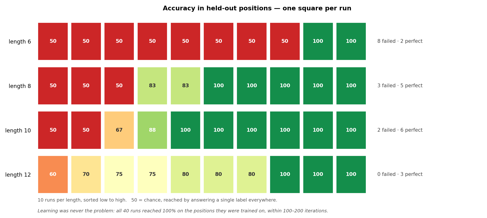

# Background-token diversity — removing the colon marker (b=1, T5)

*2026-07-19 · John Lee · code, data and figures are committed together with this log*

> **Short version.** The 7/7 note keeps the input at length 6, but the Stage 1 baseline I first
> built added a ":" before the answer, making the input 7 tokens. This log re-runs the same
> baseline with the colon removed (input is the 6-token body, answer is the next token). The
> result barely changes: at length 6 still **8 of 10 runs fail completely** (was 9), and no
> length gets a clean pass. **The colon was not the main cause** of the Stage 1 failure.

---

## Why this experiment

The previous log ([2026-07-18](2026-07-18-background-stage1-clean-baseline.md)) found that at
b=1 the model learns the task but generalizes to held-out positions in only 1 of 10 runs. One
suspect was the trailing ":". The 7/7 note draws the patterns as 6 characters with no marker
(`XY****`, `*XY***`, `X*Y***`), and in the earlier colon ablation T5 dropped to 56% with a
trailing colon and recovered to 100% when attention to it was masked. My Stage 1 build had put
the colon in, so the input was 7 tokens, not 6.

This log removes the colon so the format matches the note: the stored example is now
`<body><label>` (e.g. `XY0000T`), the model reads the 6-token body, and the answer is the next
token. Everything else — task, split, model, seeds — is identical to the previous log. The
question is simply whether the colon was causing the Stage 1 failure.

---

## The task

Same as before, now with no marker between body and answer:

```
training (X and Y in 0–2)      held-out test (X and Y in 3–5)
  XY0000 -> T   distance 1       000XY0 -> T   distance 1
  0XY000 -> T   distance 1       0000XY -> T   distance 1
  X0Y000 -> F   distance 2       000X0Y -> F   distance 2
```

Label is T if the X-Y distance is exactly 1, else F. Training places both symbols in the first
half, the test in the second half. Input is 6 tokens; b=1 so the background is all `0`.

---

## Run: lengths 6, 8, 10, 12 — 10 seeds each

**Purpose:** Repeat the previous log's length sweep with the colon removed, and compare.

**Config:** `pos_type=t5` with causal masking, `half` split, 3 layers / 2 heads / 32 dim =
38,432 params (2 fewer than before — the colon is gone from the vocab), batch 64, lr 1e-3,
2000 iterations, CPU, seeds 1337–1346. `block_size = length + 2`. Train 20,000 / val 2,000 /
test 2,000, all 50/50 T/F, so chance = 50%.

**Results:**

| length | failed completely | perfect | mean | spread (sd) |
|---|---|---|---|---|
| 6 | **8 / 10** | 2 / 10 | 60.0% | 20.0 |
| 8 | 3 / 10 | 5 / 10 | 81.7% | 21.7 |
| 10 | 2 / 10 | 6 / 10 | 85.4% | 20.3 |
| 12 | **0 / 10** | 3 / 10 | 82.0% | 13.1 |

- All 40 runs learn the task (val = 100%, reached within 100–200 iterations). As before, the
  problem is only carrying it to held-out positions.
- At length 6, 8 of 10 runs still collapse to answering one label (exactly chance). The colon
  removal moved this from 9/10 to 8/10 — with 10 seeds that is not a real difference.
- Complete failure still disappears at length 12 (0/10), same as the colon version.
- No length gets every run to a perfect score. The best is 6/10 (length 10).

**Output — all 40 runs, one square each:**



*Same figure as the previous log, now colon-free. The overall shape is unchanged: length 6
splits into mostly-red with a couple of greens, and the rows get greener with length without
ever becoming all-green.*

---

## Colon vs no colon, side by side

Perfect runs out of 10, at each length:

| length | with colon (7/18) | no colon (this log) |
|---|---|---|
| 6 | 1 | 2 |
| 8 | 4 | 5 |
| 10 | 1 | 6 |
| 12 | 4 | 3 |

Removing the colon nudges most lengths up a little, and length 10 jumps from 1 to 6, but length
6 is still mostly failure and length 12 actually goes down. Across the board the picture is the
same as with the colon: the baseline does not cleanly pass at any length.

---

## Conclusion

**What worked**

- The colon-free format matches the 7/7 note (input length 6, answer as the next token) and the
  full pipeline runs on it unchanged.
- The model still learns the task in every run.

**What didn't work**

- **Removing the colon did not fix the baseline.** Length 6 stays at 8/10 complete failures,
  and no length gets a clean pass. So the trailing colon was not the main cause of the Stage 1
  failure — the earlier suspicion is ruled out.
- Stage 1 still does not pass, so the background-token sweep has not been started.

---

## Caveats

- 10 seeds per length; a change of 1–2 out of 10 (e.g. length 6 going 9→8, or 1→2 perfect) is
  within noise and should not be read as a real effect. The one change large enough to notice is
  length 10 (1→6 perfect), but on its own that is not enough to call the colon important.
- Seeds change initialization and batch order only; the data split is fixed per length.
- Only b=1 was run. Nothing here says anything yet about background diversity itself.
- **This is still next-token readout at the last position.** The earlier experiment that hit
  100% at b=1 (the one the 7/7 note refers to) used a different readout — a classifier head that
  averages all positions — not next-token. That is a separate variable this log does not test,
  and it is the more likely remaining explanation for the gap.

---

## Reproduce

This is the **no-colon** version: the marker is empty (the `prepare.py` default), so the input
is the 6-token body and the CSVs are the `_nocolon` variants. The colon version it is compared
against is [2026-07-18](2026-07-18-background-stage1-clean-baseline.md).

```bash
NC="--results_csv=results_nocolon.csv --predictions_csv=predictions_nocolon.csv"
CU="--curves_csv=curves_nocolon.csv"

for L in 6 8 10 12; do
  ../venv/bin/python data/background/prepare.py --b=1 --length=$L       # marker defaults to ''
  for s in 1337 1338 1339 1340 1341 1342 1343 1344 1345 1346; do
    ../venv/bin/python train.py    config/basic.py --seed=$s --block_size=$((L+2)) $CU
    ../venv/bin/python evaluate.py config/basic.py --seed=$s $NC
  done
done
../venv/bin/python data/background/prepare.py --b=1      # restore length-6 data
../venv/bin/python plot.py --split=half --b=1 --grid --results_csv=results_nocolon.csv \
    --out_dir=log/figures --out_name=run_grid_nocolon_b1_half.png
```

Raw data: `results_nocolon.csv` (one row per run) and `curves_nocolon.csv` (validation curves).
The colon version's numbers are in `results_colon.csv` and the 7/18 log.
Environment: python 3.9.6 · torch 2.8.0 · numpy 2.0.2 · matplotlib 3.9.4; data `SEED=1337`.
