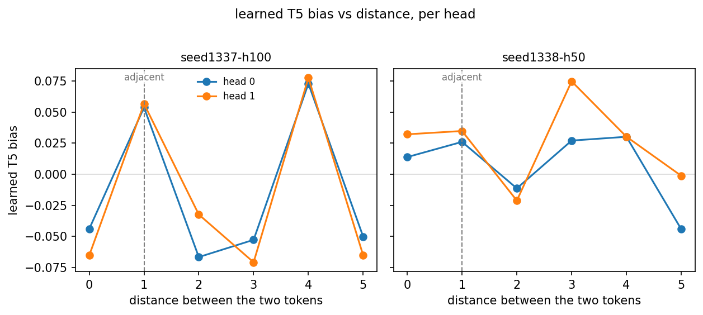

# Background (b=1): T5 bias visualization (diagnostic)

*2026-07-20 · commit `d02ac6a` · John Lee*

> **Summary.** The bias graph does not explain the failure. This was not a new experiment. It only
> draws the distance values that two already-trained models learned (from the length-6, b=1 runs:
> seed 1337 works, seed 1338 fails). The values turn out to be very small, so the answer is not here.

### The task

A length-6 string has one `X` and one `Y`, with X always to the left of Y. Every other slot is `0`.
The label is `T` when X and Y are next to each other, and `F` when there is a gap. For example
`0XY000` is T and `X0Y000` is F. We train with X and Y in the first half, then test them in the
second half, which the model never saw. "Works" means the model is still correct in that unseen half.

### What the graph shows

The graph shows how much the model leans toward tokens at each distance. This is the model's one
positional tool ("T5"). Whenever a token looks at another token, the model adds a small learned value
based on how far apart the two are. Note that this is the gap between any looker and whatever it looks
at. It is not the distance between X and Y.

Each panel has two lines, one per attention "head" (the model has two). The left panel is the seed
that works (1337). The right panel is the seed that fails (1338).

A bump at distance 1 is the sensible one. To check whether X is next to Y, a token looks at its
immediate neighbour, which is distance 1. So a bump there is exactly the move the task needs.

### What it means

The two panels are not identical, but where they differ (for example the sign at distance 0 and
distance 3) is at distances the task does not use, so it does not explain why one seed generalizes
and the other fails. What matters is what they share. Both have only a small bump at distance 1 (a
bit larger in the working seed), and both put their biggest bump at a far distance (distance 4 for
most of the lines).

The distance-1 bump makes sense, because that is the neighbour check the task needs. The distance-4
bump does not make sense. X and Y are never 4 apart, so a bump there has no clear task meaning, and we
do not know why it is there.

In any case, every value is tiny, within 0.08. That is too small to be what solves the task. With a
background of all `0`, X and Y are the only special letters, so the model can find them by which
letter they are, without using the distance tool at all.

Two cautions. First, "small means unimportant" is only safe if we compare it to the model's other
attention numbers, which we did not measure. Second, this is one working seed and one failing seed, so
any difference between them could be luck.

So the cause of the failure is not in this graph. It is somewhere later in the model, in how the model
aims its attention, or in where it reads the final answer from.

### Next

Change the task from X-then-Y to X-then-X, using two identical `X` marks instead of an X and a Y. With
two identical marks the model has no "which letter" clue left. So if it still tells `X0X000` apart from
`000X0X`, that can only be because it is using position. This is the cleanest test of the professor's
point that the model should not be able to tell them apart.
