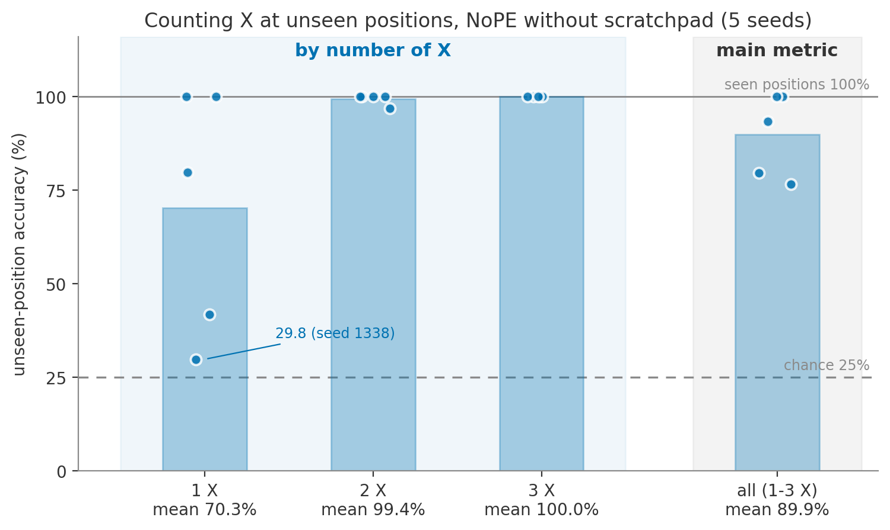

# Step 1: NoPE baseline gate for counting

**Date:** October 6, 2026
**Purpose:** Check whether a NoPE model can already count `X`s at unseen positions
without a scratchpad, before building the scratchpad conditions.

## Activity summary

I trained the no-scratchpad NoPE model on the counting task with five seeds. Every
model counted perfectly on the positions seen during training. On unseen positions,
two seeds were perfect, but three were not (79.5%, 76.6%, 93.3% on counts 1-3; mean
89.88 +/- 11.18%). Almost every error had the same form: an input with a **single `X`
in the unseen half was answered as 0**, so the model missed that `X`. Inputs with two
or three `X`s were nearly always correct. Under the plan's rule (stop only if every
seed is about 95% or higher), there is room for a scratchpad effect at length 20,
but the room is concentrated in count 1.

## Experimental setup

- Task: output the number of `X`s (0-3) in a 20-character string of lowercase letters.
- Split: every `X` in positions 0-9 for training and validation; 10-19 for the test.
- Data: 50,000 train, 5,000 validation, 2,000 test; 25% per count in every pool; data
  seed 1337.
- Model: NoPE, causal, 4 layers, 4 heads, embedding 128; no scratchpad.
- Seeds 1337-1341; 2,000 iterations; checkpoints at 500 / 1,000 / 1,500 / 2,000.
- Main metric: unseen-position accuracy on counts 1-3 (count 0 has no `X` position,
  so it is the same in both pools and reported separately).

Command:

```bash
../venv/bin/python data/count_scratchpad/prepare.py
./run_multiseed.sh
```

## Results



[Vector PDF](figures/step1_unseen_by_count.pdf)

*Figure 1. Unseen-position accuracy at 2,000 iterations. Bars are the mean over five
seeds; dots are individual seeds. Every seed scored 100% on seen positions (solid
line). Accuracy drops only for inputs with a single `X`, where three seeds often
answered 0. Count 0 (no `X`, 100% for every seed) is not shown because it does not
test an unseen position.*

Final checkpoint (2,000 iterations):

| Seed | Seen positions | Unseen, counts 1-3 | k=0 | k=1 | k=2 | k=3 |
|---|---:|---:|---:|---:|---:|---:|
| 1337 | 100% | 79.53% | 100% | 41.8% | 96.8% | 100% |
| 1338 | 100% | 76.60% | 100% | 29.8% | 100% | 100% |
| 1339 | 100% | 93.27% | 100% | 79.8% | 100% | 100% |
| 1340 | 100% | 100.00% | 100% | 100% | 100% | 100% |
| 1341 | 100% | 100.00% | 100% | 100% | 100% | 100% |
| **Mean +/- SD** | 100% | **89.88 +/- 11.18%** | 100% | 70.3% | 99.4% | 100% |

Unseen-position errors (counts, out of 500 per count):

| Seed | 1 answered as 0 | 2 answered as 1 | Any other error |
|---|---:|---:|---:|
| 1337 | 291 | 16 | 0 |
| 1338 | 351 | 0 | 0 |
| 1339 | 101 | 0 | 0 |
| 1340 | 0 | 0 | 0 |
| 1341 | 0 | 0 | 0 |

Every error was an under-count by exactly one. No model over-counted or produced a
non-digit answer.

Mean unseen accuracy (counts 1-3) across checkpoints:

| 500 | 1,000 | 1,500 | 2,000 |
|---:|---:|---:|---:|
| 87.08% | 88.35% | 89.15% | 89.88% |

Seeds 1337 and 1338 stayed flat; seed 1339 rose from 80.1% to 93.3%, so longer
training might close part of the gap for some seeds.

## Conclusion

**What worked:** Counting was learned perfectly on seen positions by every seed, and
counts 2 and 3 transferred to unseen positions almost perfectly.

**What didn't work:** Three of five seeds often missed a lone `X` in the unseen half,
answering 0 instead of 1.

**Gate decision (for review):** By the plan's rule, the baseline did not reach about
95% in every seed, so length 20 has room and the next step would be Step 3 (dummy and
meaningful scratchpads at length 20). The caveat is that the room is small and almost
entirely in count 1, and two seeds have no room at all. Making the task harder first
(Step 2) remains an option if a larger gap is wanted.
