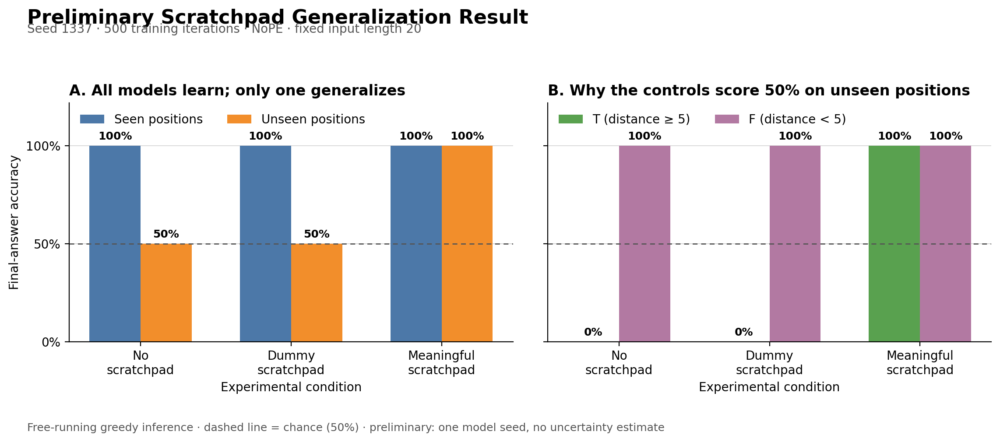

# One-seed scratchpad implementation gate

**Date:** September 27, 2026
**Purpose:** Verify the full training and chained-inference pipeline before the
formal five-seed experiment. This is not the final experimental result.

## Configuration

- Task: fixed-length `distance >= 5`, with two `X` symbols in a 20-token input.
- Position split: both `X` symbols in positions 0--9 for train/validation and
  positions 10--19 for held-out test.
- Data: 50,000 train, 5,000 validation, and 2,000 held-out examples.
- Class balance: exactly 50% `T` and 50% `F` in every split.
- Distance frequencies: identical across all splits.
- Model: 4 layers, 4 heads, embedding size 128, causal NoPE, under 1M parameters.
- Model seed: `1337`; data seed: `1337`.
- Gate budget: 500 iterations per condition, with `lr_decay_iters=500`.
- Evaluation: all validation and held-out examples; greedy free-running scratchpad
  inference.

The same raw dataset and union vocabulary were used for all three conditions.

## Commands

```bash
../venv/bin/python data/distd_scratchpad/prepare.py

../venv/bin/python train.py config/basic.py \
  --condition=<condition> --seed=1337 \
  --out_dir=out_gate_<condition> \
  --max_iters=500 --lr_decay_iters=500

../venv/bin/python evaluate.py config/basic.py \
  --out_dir=out_gate_<condition> \
  --results_csv=results_gate.csv \
  --predictions_csv=predictions_gate.csv
```

`<condition>` was replaced with `no_scratchpad`, `dummy`, and `meaningful`.

## Results



*Figure 1. All three conditions solve examples using positions seen during training,
but only the meaningful scratchpad transfers to unseen positions. The class breakdown
shows that both controls obtain 50% by predicting `F` on every unseen-position example.*

| Condition | Seen-position answer | Unseen-position answer | Unseen `T` | Unseen `F` | Unseen state | Trace exact |
|---|---:|---:|---:|---:|---:|---:|
| No scratchpad | 100% | 50% | 0% | 100% | n/a | n/a |
| Dummy scratchpad | 100% | 50% | 0% | 100% | 100% | 100% |
| Meaningful scratchpad | 100% | 100% | 100% | 100% | 100% | 100% |

Teacher-forced and free-running final-answer accuracies were identical in all six
condition/split combinations. The meaningful condition's decision state at the
second `X` was also 100% correct for both `t` and `f` on the unseen-position test set. Neither
scratchpad condition generated an invalid state token.

Teacher-forced losses from the final checkpoints:

| Condition | Seen answer loss | Seen state loss | Unseen answer loss | Unseen state loss |
|---|---:|---:|---:|---:|
| No scratchpad | 0.001049 | n/a | 4.375575 | n/a |
| Dummy scratchpad | 0.001248 | 0.000551 | 3.279934 | 0.000536 |
| Meaningful scratchpad | 0.000374 | 0.000788 | 0.000411 | 0.001228 |

The aggregate machine-readable record is [`../results_gate.csv`](../results_gate.csv).
Per-example predictions were generated locally but are ignored by Git because they
are large and reproducible.

## Interpretation

This gate supports proceeding to the formal run. The meaningful state sequence
transferred the distance rule to held-out positions in seed 1337, while the constant
dummy sequence did not. Therefore, extra sequence length and autoregressive calls
alone do not explain the observed gain in this run.

This single shortened run is not evidence that the effect is seed-robust. The next
step remains the preregistered 3-condition by 5-seed sweep at 2,000 iterations. A
positive formal result also requires the planned neutral post-decision-state ablation
to separate counting-state supervision from repeated answer supervision.

## Verification

- Python compilation passed for all experiment modules.
- All 9 state-machine, record-construction, loss-mask, and context tests passed.
- Two-iteration end-to-end smoke training and evaluation passed for all conditions.
- Full-data chained evaluation completed for all three 500-iteration checkpoints.
- Figure 1 is generated from `results_gate.csv` by `plot_preliminary.py`.
