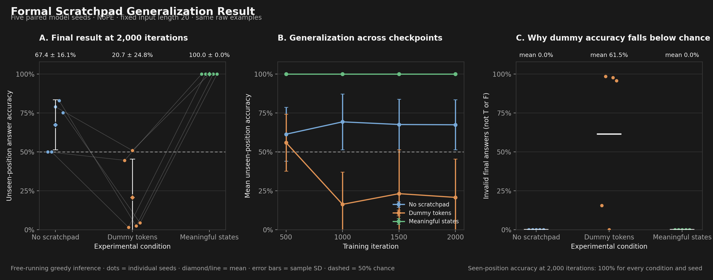

# Formal five-seed scratchpad pilot

**Date:** September 28, 2026
**Purpose:** Test whether meaningful scratchpad states improve fixed-length,
held-out-position generalization in a NoPE micro-transformer.

## Activity summary

I completed the formal scratchpad-token pilot using three matched conditions and
five paired model seeds. All models learned examples using positions seen during
training. On unseen positions, meaningful counting states achieved 100% final-answer
and full-trace accuracy for every seed, beginning at the first 500-iteration
checkpoint and remaining perfect through 2,000 iterations. No-scratchpad models were
seed-sensitive (67.39 +/- 16.11% at 2,000 iterations), while dummy-token models were
unstable and often generated `z` instead of a valid `T/F` answer. These results show
that the supervised state machine transfers reliably in this setup, but a neutral
post-decision-state ablation is still needed because the current meaningful trace
repeats the answer-bearing `t/f` state before the final answer.

## Experimental setup

- Task: output `T` when the distance between two `X` symbols is at least 5,
  otherwise output `F`.
- Raw input length: fixed at 20 in train, validation, and test.
- Position split: both `X` symbols occur in positions 0--9 during training and in
  positions 10--19 during the held-out test.
- Data: 50,000 train, 5,000 seen-position validation, and 2,000 unseen-position
  test examples.
- Distribution controls: every split is exactly 50/50 `T/F` and has the same
  distance-frequency distribution.
- Conditions: no scratchpad, constant dummy token `z`, and meaningful finite-state
  counting tokens.
- Model: custom 0.796M-parameter causal micro-transformer, 4 layers, 4 heads,
  embedding size 128, and no explicit positional encoding. nanoGPT was not used.
- Model seeds: `1337, 1338, 1339, 1340, 1341`.
- Data seed: `1337`, shared by every condition and model seed.
- Budget: 2,000 optimization iterations per run, with evaluations at 500, 1,000,
  1,500, and 2,000 iterations.
- Inference: greedy and free-running. Predicted state tokens remain in the context.
- Total: 15 training runs and 60 checkpoint evaluations.

## Results



*Figure 1. Dots are individual model seeds. Error bars are sample standard
deviations. All conditions achieved 100% seen-position answer accuracy at the final
checkpoint. The invalid-answer panel measures final outputs other than `T` or `F`.*

Final checkpoint results:

| Condition | Seen answer | Unseen answer | Unseen `T` | Unseen `F` | Invalid unseen answer | Unseen trace exact |
|---|---:|---:|---:|---:|---:|---:|
| No scratchpad | 100.00 +/- 0.00% | 67.39 +/- 16.11% | 34.78% | 100.00% | 0.00 +/- 0.00% | n/a |
| Dummy tokens | 100.00 +/- 0.00% | 20.71 +/- 24.76% | 24.00% | 17.42% | 61.47 +/- 49.36% | 100.00% |
| Meaningful states | 100.00 +/- 0.00% | 100.00 +/- 0.00% | 100.00% | 100.00% | 0.00 +/- 0.00% | 100.00% |

Final unseen-position answer accuracy by seed:

| Condition | 1337 | 1338 | 1339 | 1340 | 1341 |
|---|---:|---:|---:|---:|---:|
| No scratchpad | 50.00% | 50.00% | 79.00% | 82.85% | 75.10% |
| Dummy tokens | 44.55% | 1.50% | 50.85% | 2.35% | 4.30% |
| Meaningful states | 100.00% | 100.00% | 100.00% | 100.00% | 100.00% |

Mean unseen-position accuracy by checkpoint:

| Condition | 500 | 1,000 | 1,500 | 2,000 |
|---|---:|---:|---:|---:|
| No scratchpad | 61.33 +/- 17.25% | 69.27 +/- 18.00% | 67.57 +/- 16.25% | 67.39 +/- 16.11% |
| Dummy tokens | 55.90 +/- 18.33% | 16.24 +/- 20.75% | 23.11 +/- 28.21% | 20.71 +/- 24.76% |
| Meaningful states | 100.00 +/- 0.00% | 100.00 +/- 0.00% | 100.00 +/- 0.00% | 100.00 +/- 0.00% |

Meaningful decision-state accuracy at the second `X` was also 100% for every seed
and checkpoint, as were state-token accuracy and full-trace exact match. Therefore,
the intermediate counting rule itself transferred to the held-out positions.

## Dummy-output diagnostic

The dummy condition's below-chance answer accuracy should not be interpreted as
reversed binary reasoning. Its final output layer often continued emitting the
scratchpad token `z` at the answer position on unseen examples.

| Seed | Invalid answer rate | Final output counts on 2,000 unseen examples |
|---|---:|---|
| 1337 | 15.50% | `F`: 1,490; `z`: 310; `T`: 200 |
| 1338 | 98.50% | `z`: 1,970; `F`: 30 |
| 1339 | 0.00% | `T`: 1,983; `F`: 17 |
| 1340 | 97.65% | `z`: 1,953; `F`: 47 |
| 1341 | 95.70% | `z`: 1,914; `F`: 86 |

The evaluator now reports invalid final-answer rate explicitly for future runs. The
formal rate above was reconstructed exactly from the saved per-example predictions,
so retraining was not required.

## Interpretation

1. All conditions solved the seen-position task, so the comparison is not confounded
   by ordinary optimization failure at the final checkpoint.
2. Meaningful states were the only intervention that produced perfect and
   seed-robust transfer to unseen positions.
3. The 100% decision state and full trace show that the finite-state counting
   algorithm generalized, not only the final answer token.
4. Extra sequence length and extra autoregressive calls are insufficient: the
   length-matched dummy condition did not reproduce the effect.
5. No-scratchpad behavior is strongly seed-sensitive. Three seeds partially learned
   a transferable rule, while two collapsed to always predicting `F`.
6. More training did not reliably improve the controls. Their unseen accuracy was
   non-monotonic even though seen accuracy and loss improved. Held-out test results
   were not used to select a checkpoint.

The result is a strong positive pilot for supervised scratchpad states, not yet a
complete causal isolation of intermediate computation.

## Main limitation and next experiment

After the second `X`, the current meaningful condition repeats `t` or `f` through
the delimiter, placing an answer-bearing state immediately before the final `T/F`.
Although perfect decision-state and trace accuracy prove that counting transferred,
the final-answer improvement could still benefit from this adjacent label cue.

The next ablation should:

1. Keep the counting states `i/a/b/c/d/e` unchanged.
2. Emit `t/f` only once, at the second `X`.
3. Emit a neutral state `g` after the second `X` and after the delimiter.
4. Retain only one final uppercase `T/F` answer target.
5. Run a one-seed implementation gate, then the same five paired seeds if the gate
   behaves correctly.

This tests whether the model can use a meaningful intermediate decision stored
earlier in the trace rather than copying an immediately adjacent answer-bearing
state.

## Reproducibility and verification

- `results_multiseed.csv`: 60 data rows = 3 conditions x 5 seeds x 4 checkpoints.
- `predictions_multiseed.csv`: 105,000 data rows = 15 final models x
  (5,000 validation + 2,000 test examples). This file is ignored by Git because it
  is large and reproducible.
- `results_multiseed_summary.csv`: statistics used in this report and figure.
- Every expected condition/seed/checkpoint key occurs exactly once.
- All 9 unit tests passed after the evaluation update.
- The figure and summary are regenerated by `plot_multiseed.py`, which rejects
  missing or duplicate result-grid entries.

Formal command:

```bash
./run_multiseed.sh
```

Summary and figure command:

```bash
../venv/bin/python plot_multiseed.py
```
