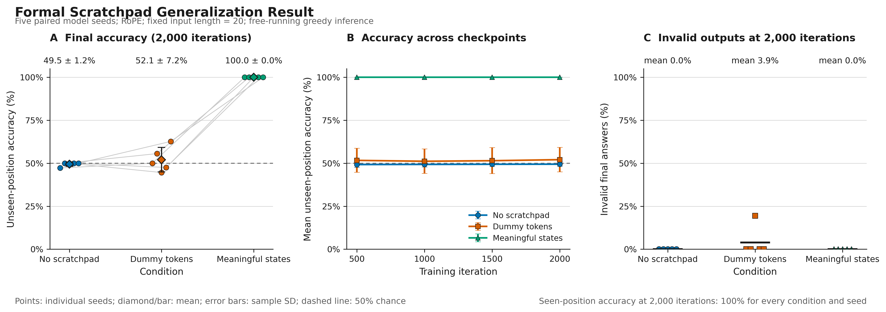

# RoPE replication of the five-seed scratchpad pilot

**Date:** October 6, 2026
**Purpose:** Check whether the NoPE scratchpad result also holds with RoPE, as
suggested in the October 2 meeting, and whether RoPE already generalizes without a
scratchpad.

## Activity summary

I repeated the formal scratchpad pilot with RoPE instead of NoPE. Everything else was
the same: task, data, conditions, model size, seeds, and training budget. Meaningful
scratchpad states again reached 100% accuracy on unseen positions for all five seeds
and every checkpoint, matching the NoPE result. RoPE did **not** generalize without a
scratchpad: all five no-scratchpad models predicted `F` for almost every unseen
example (49.45 +/- 1.23%, 0% on the far class). The dummy condition was also near
chance (52.09 +/- 7.18%). So the concern that RoPE might reach 100% without a
scratchpad did not happen in this setting.

## Experimental setup

Identical to [`2026-09-28-formal-multiseed.md`](2026-09-28-formal-multiseed.md),
except for the positional encoding:

- Positional encoding: **RoPE** (rotary, applied to queries and keys).
- Task: `T` if the distance between the two `X` symbols is at least 5, otherwise `F`.
- Raw input length fixed at 20; `X` symbols in positions 0--9 for training and
  10--19 for the held-out test.
- Data: the same raw dataset (data seed `1337`). The data files' MD5 hashes were
  checked before and after the sweep and did not change.
- Model: 4 layers, 4 heads, embedding 128, causal mask.
- Model seeds `1337--1341`; 2,000 iterations; checkpoints at 500 / 1,000 / 1,500 /
  2,000.
- Total: 15 training runs and 60 checkpoint evaluations.

Command:

```bash
POS_TYPE=rope RUN_PREFIX=out_rope RESULTS_CSV=results_multiseed_rope.csv PREDICTIONS_CSV=predictions_multiseed_rope.csv ./run_multiseed.sh
```

## Results



[Vector PDF](../figures/rope-multiseed-result.pdf)

*Figure 1. Dots are individual model seeds. Error bars are sample standard
deviations. All conditions reached 100% seen-position answer accuracy.*

Final checkpoint (2,000 iterations), mean +/- sample SD across five seeds:

| Condition | Seen answer | Unseen answer | Unseen `T` | Unseen `F` | Invalid unseen answer | Unseen trace exact |
|---|---:|---:|---:|---:|---:|---:|
| No scratchpad | 100.00 +/- 0.00% | 49.45 +/- 1.23% | 0.00% | 98.90% | 0.00 +/- 0.00% | n/a |
| Dummy tokens | 100.00 +/- 0.00% | 52.09 +/- 7.18% | 12.52% | 91.66% | 3.89 +/- 8.70% | 100.00% |
| Meaningful states | 100.00 +/- 0.00% | 100.00 +/- 0.00% | 100.00% | 100.00% | 0.00 +/- 0.00% | 100.00% |

Unseen-position answer accuracy by seed at 2,000 iterations:

| Condition | Seed 1337 | Seed 1338 | Seed 1339 | Seed 1340 | Seed 1341 |
|---|---:|---:|---:|---:|---:|
| No scratchpad | 47.25% | 50.00% | 50.00% | 50.00% | 50.00% |
| Dummy tokens | 50.00% | 55.60% | 44.60% | 47.55% | 62.70% |
| Meaningful states | 100.00% | 100.00% | 100.00% | 100.00% | 100.00% |

The meaningful condition's decision state at the second `X` was also 100% correct on
unseen positions for every seed.

### Comparison with NoPE

| Condition | NoPE unseen answer | RoPE unseen answer |
|---|---:|---:|
| No scratchpad | 67.39 +/- 16.11% | 49.45 +/- 1.23% |
| Dummy tokens | 20.71 +/- 24.76% | 52.09 +/- 7.18% |
| Meaningful states | 100.00 +/- 0.00% | 100.00 +/- 0.00% |

- **Meaningful states:** identical (100%) under both encodings, as expected.
- **No scratchpad:** RoPE was worse and more consistent than NoPE. Three NoPE seeds
  partly transferred the far class; no RoPE seed did. This agrees with the earlier
  June PE sweep, where RoPE without a scratchpad averaged about 55% on this split
  (before the dataset was rebalanced).
- **Dummy tokens:** the failure looked different. NoPE dummy models often output `z`
  instead of `T/F`; RoPE dummy models mostly output a valid but wrong `F`.

## Conclusion

**What worked:** The meaningful scratchpad result replicates with RoPE: 100% on unseen
positions for all seeds and checkpoints.

**What didn't work:** RoPE without a scratchpad, and with dummy tokens, stayed near
chance on unseen positions, predicting "near" for almost every example.

**Answer to the meeting question:** In this setting (length 20, half split), RoPE does
not reach 100% without a scratchpad, so there is clear room for the scratchpad effect.
This does not tell us whether the same holds for the counting task, which still needs
its own baseline gate.

**Changes made:** `run_multiseed.sh` now takes `POS_TYPE` and `RUN_PREFIX`
(defaults keep the NoPE behavior), and `plot_multiseed.py` takes `--pe_label` for the
figure subtitle.
