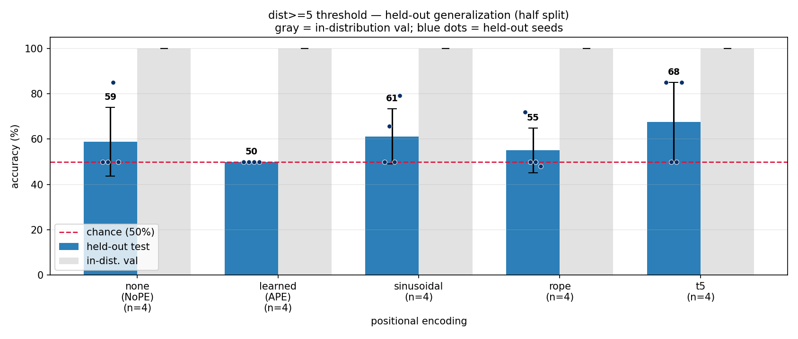
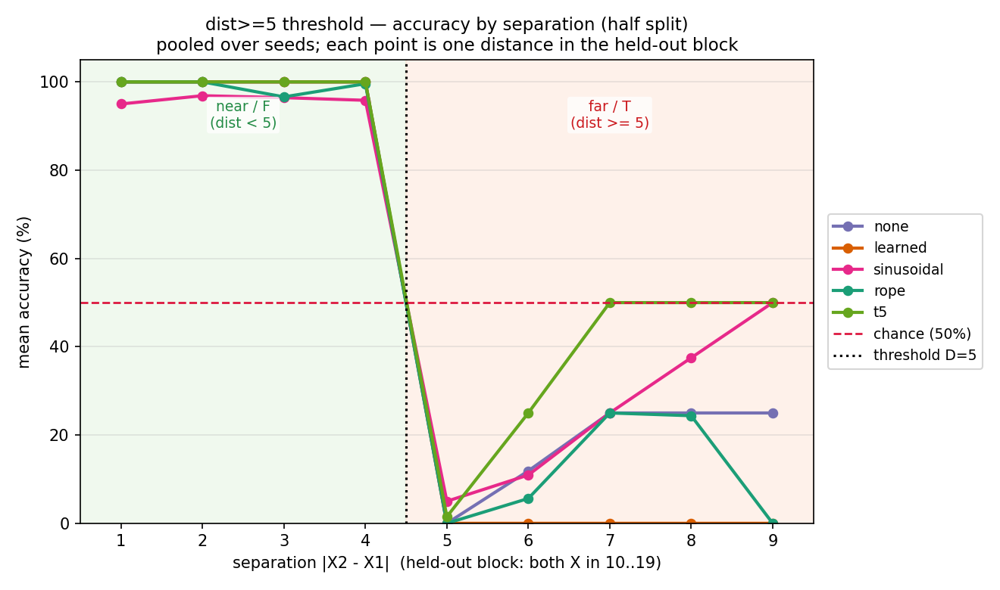
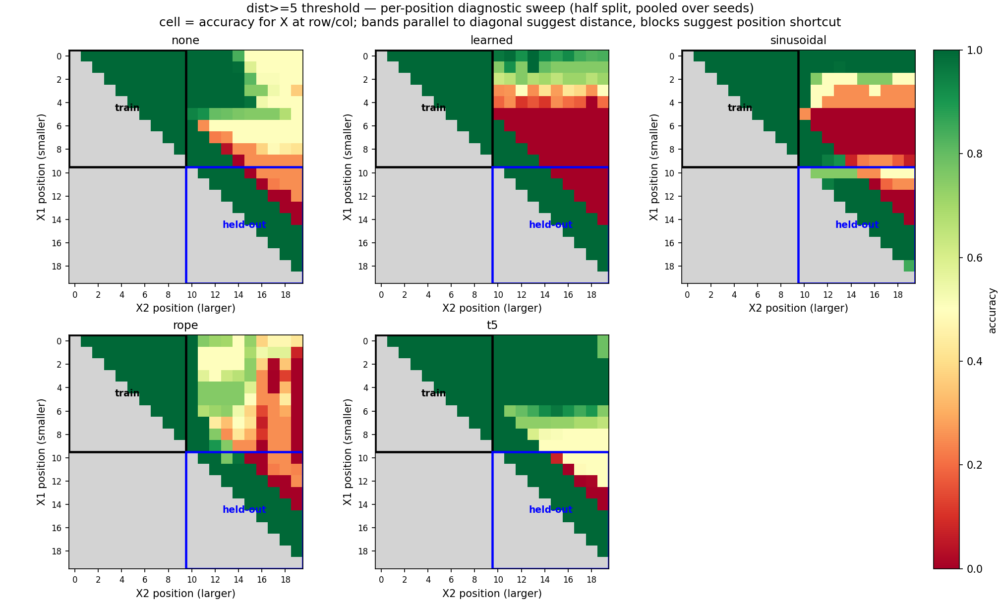

# dist≥D threshold — coarse distance clears the even/odd wall (Phase 3, distance task #2)

*2026-06-26 · commit `<pending>` · John Lee*

> **Bottom line.**
>
> 1. A micro-transformer (<1M params) **learns dist≥5 perfectly in-distribution** — all 20
>    runs (5 PE × 4 seeds) reach **100% val**. This **clears the even/odd capacity wall**:
>    even/odd parity was unlearnable at this scale, dist≥D is not. So the even/odd wall was
>    about parity's **exactness**, not about distance-reading in general.
> 2. Held-out (generalize-to-unseen-positions) accuracy is **partial and strongly
>    seed-dependent**, and most of it is the *near* class transferring while *far* is
>    predicted "near". The held-out means (t5 68 · sinusoidal 61 · none 59 · rope 55 ·
>    learned 50) have large per-seed spread (σ up to ~18) and are **not a real ranking** at
>    n=4 — the middle four are within noise. This is *not* the clean "NoPE fails /
>    distance-aware wins" story even/odd was meant to deliver.
> 3. The one **robust** separation: absolute **`learned` (APE) never generalizes** — all 4
>    seeds collapse to exactly 50% (predict "near" for everything). Every other PE
>    generalizes on **at least one** seed. On a *distance* task the absolute method is
>    uniquely worst — consistent with APE "learns-but-doesn't-generalize" on relative-order
>    and on even/odd@4.76M.
> 4. **Mechanism — what actually transfers is "near", not "far".** Pooled over seeds, the
>    held-out separation curve solves the **near** classes (d1–4 ≈ 100%) but stays **at or
>    below chance for every far distance (d5–9)** — the far (T) side does *not* climb back to
>    100%. So on held-out positions the models mostly predict "near" and only the near class
>    survives. A few individual seeds *do* recover the far side (e.g. t5/1337 hits ~100% at
>    d7–9), but that is seed-specific and washes out in the pool. Read the per-seed table, not
>    just the pooled curve.
> 5. **Distance vs position shortcut is unresolved (leaning shortcut).** The per-position
>    heatmaps do **not** show clean diagonal (distance) bands in the held-out block; the
>    held-out block is sparsely sampled and the visible structure looks closer to
>    position **blocks** (accuracy depends on how far X2 sits to the right, i.e. on the
>    positions themselves) than to constant-distance bands. The spec's confound — dist≥D
>    correlating with "X's at opposite ends" — is **not ruled out and may be what's driving
>    the partial generalization.** This is the main reason method B (distance-held-out) is
>    needed.

### The task

A fixed string of **20 characters** contains the symbol `X` **exactly twice** (no `Y`; the
two targets are identical); the other 18 are random digits. Distance = `|pos2 − pos1|`.
Threshold **D = 5**. Label is **`T` if distance ≥ 5 (far)**, **`F` if distance < 5 (near)**.

```
482X50178X4019285746 : T     X at 3 and 9  →  distance 6 ≥ 5  →  T (far)
482X5X1786401928574 6: F     X at 3 and 5  →  distance 2 < 5  →  F (near)
```

The five positional encodings compared (the one knob that changes, `pos_type`):

- `none` — **NoPE**: no positional encoding at all
- `learned`, `sinusoidal` — **absolute** PE (encodes each fixed slot)
- `rope`, `t5` — **relative / distance-aware** PE (encodes the gap between positions)

This is the **coarse** sibling of even/odd: dist≥D needs only a *monotone* "far vs near"
sense of the gap, not its exact parity — the hypothesis being that coarseness might fit
under the micro budget that parity could not.

---

## Setup  <!-- R1/R3/R6 -->

- **data:** length 20, two `X`'s; pools 50k train / 5k val / 2k test, all **50/50 T/F**
  (chance = 50%). `D=5` is single-sourced in `prepare.py` and stored in `meta.pkl`.
- **split (`half`):** train/val both X in 0–9; held-out test both X in 10–19. The held-out
  test is **distance-balanced** with exact 50/50 class balance prioritized — distances
  1/2/3/4 → 250 each (F=1000), distances 5/6/7/8/9 → 200 each (T=1000).
- **checks (`prepare.py`):** label-correctness (`|pos2−pos1| ≥ 5` iff T) + split rule asserted
  on every example; per-distance counts printed.
- **model:** the micro baseline — `n_layer=4, n_head=4, n_embd=128` (**0.80M params**),
  `block_size=64`.
- **optimizer / schedule:** AdamW · `lr=1e-3` cosine · `max_iters=2000` · `batch_size=64`.
- **loss / device:** answer-token-only loss · CPU.
- **seeds:** 1337–1340 (vary model init + batch order only; **one fixed data split**).
- **env:** python 3.9.6 · torch 2.8.0 · numpy 2.0.2 · matplotlib 3.9.4; data `SEED=1337`.
- **reproduce:**
  ```bash
  ../venv/bin/python data/distd/prepare.py
  for pe in none learned sinusoidal rope t5; do for s in 1337 1338 1339 1340; do
    ../venv/bin/python train.py    config/basic.py --pos_type=$pe --seed=$s
    ../venv/bin/python evaluate.py config/basic.py --pos_type=$pe --seed=$s
  done; done
  ../venv/bin/python plot.py --split=half --out_dir=log/figures
  ../venv/bin/python plot.py --split=half --separation --out_dir=log/figures
  ```

### Learnability gate (run first, per spec)

Before the sweep, two PEs at micro scale, seed 1337: **both `learned` and `rope` reached
100% in-dist val by iter ~250** (val loss → 0). The curve climbs immediately — no flat
50%/ln-2 wall. Gate **passed decisively**, so the full sweep proceeded. (Contrast: even/odd
stayed pinned at 50% even at 15k iters.)

---

## Results  <!-- R5/R7/R9 -->

Every run learned the task in-distribution; the differences are entirely in **generalization**.

| PE | family | in-dist val | held-out mean | held-out per seed (1337/8/9/40) | seeds that generalized |
|---|---|---|---|---|---|
| `none` | NoPE | 100% | **58.8%** (σ15.2) | 50 / 50 / **85** / 50 | 1/4 |
| `learned` | absolute | 100% | **50.0%** (σ0.0) | 50 / 50 / 50 / 50 | **0/4** |
| `sinusoidal` | absolute | 100% | **61.2%** (σ12.2) | 50 / **66** / 50 / **79** | 2/4 |
| `rope` | relative | 100% | **55.0%** (σ9.9) | **72** / 50 / 50 / 48 | 1/4 |
| `t5` | relative | 100% | **67.5%** (σ17.6) | **85** / 50 / 50 / **85** | 2/4 |

"Generalized" = held-out T-class accuracy > 0 (i.e. did not collapse to predicting "near").
**When a model fails to generalize it collapses to F (near): T-acc = 0%, F-acc = 100%.**

With 4 seeds and one fixed data split, the middle of the table (none/sinusoidal/rope/t5,
55–68%) is within noise — the only statistically clean statements are **(a) all learn
in-dist (100%)** and **(b) `learned` collapses on every seed (50.0%, σ0)** while the other
four each clear chance on ≥1 seed.

**Figures** (from `results.csv` / `predictions.csv` via `plot.py`; committed under `figures/`):



*Bar chart — every PE is at 100% in-dist val (gray); held-out (blue) ranges 50–68% with wide
seed error bars. `learned` sits exactly on the chance line.*



*Accuracy vs separation, pooled over seeds, held-out region only.
The **near** classes (distances 1–4, label F) are solved at ≈100%. At and beyond the
threshold the curves **drop to chance or below and stay there**: every far distance (d5–9)
sits at or under the 50% line for all methods, and `learned` is flat at 0% (always predicts
"near"). The far (T) side does **not** recover to 100% in the pool — what looks like
generalization is mostly the near class being classified correctly while far is predicted
"near". (Individual generalizing seeds do lift the far side; see the per-seed table.)*



*Per-position heatmaps (pooled). Train block (upper-left) solid green (100% in-dist). The
**held-out block (lower-right) is sparsely sampled** and does **not** show clean
diagonal/distance bands — the visible structure (clearest in `learned`, `sinusoidal`, `rope`)
looks closer to position **blocks**: accuracy tracks where X2 sits (red toward the far-right
columns) rather than the gap `|x2−x1|`. This is consistent with a position shortcut rather
than distance reading, and is not ruled out. Pooling also mixes generalizing and collapsed
seeds, so read this together with the per-seed table.*

### Mechanism: only some seeds read distance; pooled, "near" is what transfers

The pooled separation curve (above) keeps the far side at/below chance. That pooled picture is
the honest headline. *Underneath* it, a few individual seeds do recover the far side cleanly —
here are the strong generalizers, per distance:

| (PE, seed) | d1 | d2 | d3 | d4 | **d5** | **d6** | d7 | d8 | d9 |
|---|--|--|--|--|--|--|--|--|--|
| t5 / 1337 | 1.0|1.0|1.0|1.0| **.04** | **.50** |1.0|1.0|1.0|
| t5 / 1340 | 1.0|1.0|1.0|1.0| **.02** | **.50** |1.0|1.0|1.0|
| none / 1339 | 1.0|1.0|1.0|1.0| **.00** | **.47** |1.0|1.0|1.0|

On *these* seeds the shape is coarse-distance-like: near solved, far solved, **failing only
right at the threshold** (d5 ≈ 0, d6 ≈ chance) — the boundary is the hard part, a localized
echo of the parity difficulty. But this is **a minority of seeds** (the table above is 3 of
20 runs); most runs collapse to all-"near", which is why the pool sits at chance on the far
side. So "coarse distance is read" is true *for some seeds*, not a property of the setup.

**And even on the generalizing seeds, position matters — the shortcut isn't excluded.** At a
*fixed* far distance d=6, accuracy depends on where the pair sits:

| (PE, seed) | x1=10 | x1=11 | x1=12 | x1=13 |
|---|--|--|--|--|
| t5 / 1337 | 1.0 | 1.0 | 0.0 | 0.0 |
| t5 / 1340 | 1.0 | 0.95 | 0.05 | 0.0 |
| none / 1339 | 1.0 | 0.90 | 0.0 | 0.0 |

Pairs adjacent to the trained region (x1≤11) are correct; pairs deeper into the held-out half
(x1≥12) revert to "near", at the *same* distance. So accuracy is driven partly by **position
(proximity to the trained region)**, not by distance alone — exactly the confound the spec
flagged. Distance and position are entangled on this split, which method B is designed to
separate.

---

## Why / interpretation

- **Even/odd vs dist≥D localizes the wall to exactness.** Same engine, same budget, same
  distance family — only the label granularity changed (parity → threshold) and the task
  went from *unlearnable* (50% val) to *trivially learnable* (100% val). So the micro
  bottleneck even/odd hit is the **precision** of the distance read (parity needs the exact
  value mod 2), not the ability to read distance at all. *(Confirmed by the gate + the 20/20
  100%-val runs.)*
- **Absolute `learned` PE is the lone consistent generalization failure.** It learns
  position-specific features for slots 0–9 that simply don't transfer to 10–19, so it
  defaults to one class (near). This is the third task on which APE shows the
  "learns-but-doesn't-generalize" signature (relative-order; even/odd@4.76M; now dist≥D).
  *(Robust: 0/4 seeds, σ0.)*
- **The "absolute wins on distance" hypothesis is not supported.** The spec asked whether
  absolute would *beat* NoPE on a distance task (the flip side of relative-order). It does
  not: `learned` is worst, and `sinusoidal` (also absolute) only ties the noisy middle. If
  anything the relative **t5** leads — but the seed variance makes that directional, not
  conclusive. *(Hypothesis, under-powered at 4 seeds.)*
- **Coarse distance is read by some seeds, but held-out generalization is weak overall.** On
  the held-out half the pool keeps the far (T) side at/below chance; only the near (F) class
  transfers reliably, and only a minority of seeds recover the far side. So *precise* distance
  (parity) defeats every micro model, while *coarse* distance (threshold) is **learnable
  in-distribution but only partially generalizes across positions, mostly via the near
  class** — and where it does generalize, position proximity (not distance alone) is part of
  the cause. This is weaker and messier than the spec's anticipated "coarse distance survives
  NoPE"; the honest version is "coarse distance is micro-learnable, but position
  generalization on this split is partial and confounded." *(Seed-dependent; shortcut not
  excluded.)*

## Caveats / limitations

- **High seed variance, n=4, one fixed data split.** Seeds vary only init + batch order; the
  middle of the table (none/sinusoidal/rope/t5) is not separable at this power. Regenerating
  data per seed is the stronger protocol and the next step.
- **The position/shortcut confound is not eliminated and may drive the result.** On the
  generalizing seeds, accuracy at a fixed distance still depends on position (proximity to the
  trained region), and the held-out heatmaps look more block-like (position) than band-like
  (distance). "dist≥D generalizes across positions" is therefore **not established** on this
  split; it should be read as "partial, confounded with position." Method B (distance-held-out)
  is the clean test.
- **One threshold (D=5) and one split (`half`, method A).** Other D shifts class balance and
  difficulty; the distance-held-out split (method B) is a separate axis, deliberately out of
  scope here.
- **Saturated in-dist metric.** val=100% everywhere means the gate can't rank the PEs on
  learning *speed*; only generalization differentiates them.

## Relation to prior work

None cited — the fixed-length-position-generalization setting still has no canonical
reference reviewed. (Length-generalization PE papers on the reading list target a different
shift.)

## Next

1. **Reseed data per seed** to turn the noisy middle (none/sinusoidal/rope/t5, 55–68%) into a
   real ranking, or confirm it's a wash.
2. **Sweep D** (e.g. 3, 7, 10) — does the threshold's position (and the d5-type boundary
   failure) move predictably with D? Is the position-fade worse for D near the region edges?
3. **Distance-held-out split (method B)** — train near distances, test far: isolates distance
   extrapolation from the position-depth confound that muddies method A here.
4. **Mechanistic probe** of a `learned` collapse vs a `t5` generalizer to confirm the
   position-feature-doesn't-transfer story for APE.
