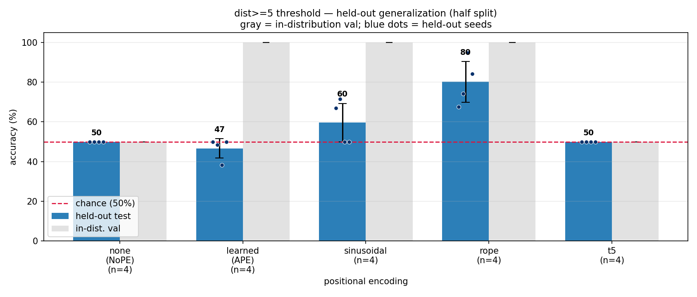
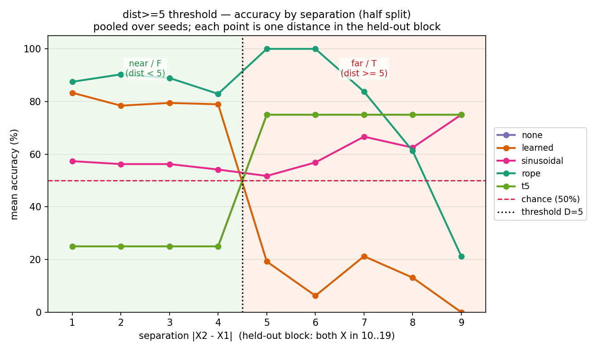
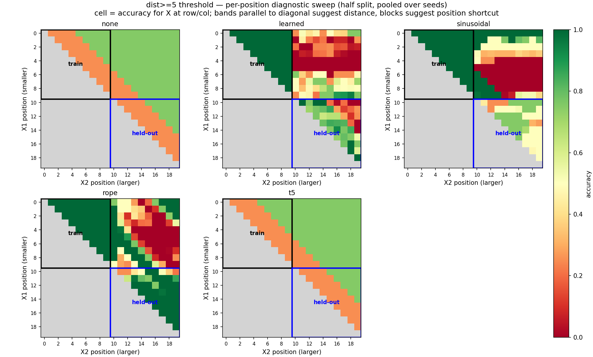
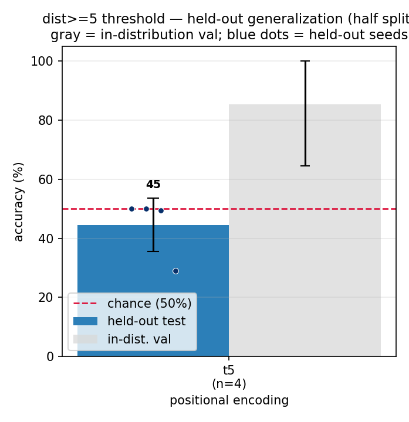

# dist>=D threshold — causal-mask ablation and T5 diagnostic (Phase 3)

*2026-06-30 · commit `9815a3e` · John Lee*

> **Main takeaway.**
>
> Removing the causal mask is **not uniformly helpful or harmful**. It strongly helps **RoPE**
> on the held-out half split (held-out mean **80.2%**, up from 55.0% in the causal sweep),
> does **not** rescue learned absolute PE, and removes the implicit positional signal that
> NoPE had under causal attention. T5 is the complicated case: a fully bidirectional T5
> bucket scheme fails the in-distribution learnability gate, while a mask-only T5 diagnostic
> can learn in-distribution on some seeds but still fails held-out generalization.

### The task

Same fixed-length distance-threshold task as the 2026-06-26 sweep. A length-20 string
contains exactly two `X` symbols and 18 random digits. Label is `T` iff the distance between
the two `X` positions is at least **D=5**, else `F`.

```
482X50178X4019285746 : T     X at 3 and 9  -> distance 6 >= 5
482X5X17864019285746 : F     X at 3 and 5  -> distance 2 < 5
```

This run tests Prof. MacCormick's suggestion that the **causal mask** might be a source of
the first-half / second-half asymmetry.

---

## Setup

- **data / split:** unchanged from the prior `dist>=5` run. Train/val have both `X`s in
  positions 0-9; held-out test has both `X`s in positions 10-19. Train/val/test are balanced
  50/50 over `T/F`; chance = 50%.
- **model:** micro-transformer, `n_layer=4`, `n_head=4`, `n_embd=128`, `block_size=64`,
  about 0.80M params.
- **training:** answer-token-only loss, AdamW, `lr=1e-3`, cosine decay, `max_iters=2000`,
  `batch_size=64`, CPU.
- **seeds:** 1337-1340; one fixed data split, varying init and batch order only.
- **env:** python 3.9.6 · torch 2.8.0 · numpy 2.0.2 · matplotlib 3.9.4.

Two ablations were run:

1. **Full bidirectional sweep:** `causal=False`; for T5, `t5_bias_mode=auto`, which means
   bidirectional T5 buckets when the attention mask is non-causal.
2. **T5 mask-only diagnostic:** `causal=False`, but `t5_bias_mode=causal`, so attention is
   unmasked while T5 keeps the original causal/unidirectional bucket scheme.

Reproduce:

```bash
cd generalization-distd

# Full bidirectional PE sweep
for pe in none learned sinusoidal rope t5; do
  for s in 1337 1338 1339 1340; do
    OUT="out_bidir_${pe}_${s}_20260630-041607"
    ../venv/bin/python train.py config/basic.py \
      --pos_type=$pe --seed=$s --causal=False --out_dir=$OUT
    ../venv/bin/python evaluate.py config/basic.py \
      --out_dir=$OUT \
      --results_csv=results_bidir_20260630-041607.csv \
      --predictions_csv=predictions_bidir_20260630-041607.csv
  done
done

../venv/bin/python plot.py --split=half \
  --results_csv=results_bidir_20260630-041607.csv \
  --predictions_csv=predictions_bidir_20260630-041607.csv \
  --out_dir=out_bidir_figures_20260630-041607
../venv/bin/python plot.py --split=half --separation \
  --results_csv=results_bidir_20260630-041607.csv \
  --predictions_csv=predictions_bidir_20260630-041607.csv \
  --out_dir=out_bidir_figures_20260630-041607

# T5 mask-only diagnostic
for s in 1337 1338 1339 1340; do
  OUT="out_t5_maskonly_${s}_20260630-055048"
  ../venv/bin/python train.py config/basic.py \
    --pos_type=t5 --seed=$s --causal=False --t5_bias_mode=causal --out_dir=$OUT
  ../venv/bin/python evaluate.py config/basic.py \
    --out_dir=$OUT \
    --results_csv=results_t5_maskonly_20260630-055048.csv \
    --predictions_csv=predictions_t5_maskonly_20260630-055048.csv
done
```

---

## Results

### Summary: what removing the causal mask did

Read this as an ablation — each PE's prior **causal** run (2026-06-26) vs this **bidirectional**
run. `in-dist` = "did it learn the train region?" (chance 50%); `held-out` = "did it generalize
to the held-out half?" (chance 50%).

| PE | causal: in-dist → held-out | bidirectional: in-dist → held-out | effect of removing the mask |
|---|---|---|---|
| `none` (NoPE) | 100% → 58.8% | **50%** → 50.0% | **stops learning** — the mask was its only position signal |
| `learned` (abs) | 100% → 50.0% | 100% → 46.7% | still fails to generalize |
| `sinusoidal` (abs) | 100% → 61.2% | 100% → 59.6% | ~no change |
| `rope` (rel) | 100% → 55.0% | 100% → **80.2%** | **big gain** — all 4 seeds now above chance |
| `t5` (rel) | 100% → 67.5% | **50%** → 50.0% | **stops learning** — bidirectional buckets break it |

An in-dist of `50%` means the model never learned the train region, so its held-out 50% reads
as "didn't learn," **not** "learned but didn't generalize." Only `learned`, `sinusoidal`, and
`rope` learned in-dist in *both* conditions, so only their held-out numbers are a true
before/after on generalization — and among those, only `rope` moved (the other two stayed flat
or failing). `none` and `t5` are not comparable here: removing the mask broke their learning, not
(yet) their generalization.

### Full bidirectional sweep (detailed)

Raw files (committed: the small aggregate CSV + the figures copied under `figures/2026-06-30/`;
local-only and regenerable: the per-example predictions CSV and the `out_*` run/figure dirs):

- `results_bidir_20260630-041607.csv` (committed)
- `predictions_bidir_20260630-041607.csv` (gitignored — regenerate via `evaluate.py`)
- `out_bidir_figures_20260630-041607/` (gitignored — committed copies live in `figures/2026-06-30/`)

| PE | in-dist val per seed | held-out per seed | held-out mean | T mean | F mean |
|---|---|---|---:|---:|---:|
| `none` | 50.0 / 50.0 / 50.0 / 50.0 | 50.0 / 50.0 / 50.0 / 50.0 | **50.00%** | 75.00% | 25.00% |
| `learned` | 100 / 100 / 100 / 100 | 50.0 / 48.4 / 38.2 / 50.0 | **46.65%** | 12.20% | 81.10% |
| `sinusoidal` | 100 / 100 / 100 / 100 | 67.0 / 71.5 / 50.0 / 50.0 | **59.61%** | 63.30% | 55.92% |
| `rope` | 100 / 100 / 100 / 100 | 67.5 / 74.2 / 94.8 / 84.2 | **80.17%** | 73.05% | 87.30% |
| `t5` | 50.0 / 50.0 / 50.0 / 50.0 | 50.0 / 50.0 / 50.0 / 50.0 | **50.00%** | 75.00% | 25.00% |

*`T mean` / `F mean` are held-out per-class accuracy. For the collapsed configs (`none`, `t5`,
in-dist 50%) they only reflect which single class each seed happened to default to and carry no
signal — read them only for the configs that actually learned (`rope`, `sinusoidal`, `learned`).
For `rope`, F (near, 87.3%) transfers better than T (far, 73.1%), i.e. the far side is harder.*

**Figures:**



*Held-out vs in-dist accuracy by PE. RoPE is the only method clearly above chance across all seeds.*



*Held-out accuracy vs the true distance between the two `X`s. Near distances (<5, class F) transfer broadly; the far side (≥5, class T) is where the methods diverge.*



*Per-position held-out accuracy (held-out block, both `X`s at positions ≥10). Read this before claiming RoPE reads distance: clean distance bands = real extrapolation; accuracy that tracks position instead = a shortcut.*

### T5 diagnostic

Raw files (same convention as above):

- `results_t5_maskonly_20260630-055048.csv` (committed)
- `predictions_t5_maskonly_20260630-055048.csv` (gitignored — regenerate via `evaluate.py`)
- `out_t5_maskonly_figures_20260630-055048/` (gitignored — committed copy in `figures/2026-06-30/`)

| T5 condition | in-dist val per seed | held-out per seed | held-out mean | note |
|---|---|---|---:|---|
| causal baseline | 100 / 100 / 100 / 100 | 85.2 / 50.0 / 50.0 / 85.0 | **67.55%** | original 2026-06-26 sweep |
| bidirectional bucket | 50.0 / 50.0 / 50.0 / 50.0 | 50.0 / 50.0 / 50.0 / 50.0 | **50.00%** | fails learnability gate |
| mask-only | 50.0 / 100 / 91.3 / 100 | 50.0 / 50.0 / 49.4 / 29.0 | **44.60%** | learnability partly restored, OOD still fails |



*T5 mask-only (unmasked attention, causal buckets) held-out accuracy by seed: in-dist learnability partly returns (3/4 seeds) but held-out stays at or below chance.*

---

## Interpretation

1. **Causal mask removal helps RoPE.** RoPE's held-out mean rises from the prior causal
   sweep's 55.0% to 80.2%, with all four seeds above chance and one seed at 94.8%. This
   supports the hypothesis that causal left-to-right information flow was part of the
   first-half / second-half asymmetry, at least for RoPE.

2. **NoPE loses its implicit positional signal.** With no positional encoding and no causal
   mask, NoPE does not learn the task in-distribution. This is expected: under causal
   attention, the mask itself provides an order/position asymmetry; after removing it,
   NoPE has almost no usable position signal for distance.

3. **Learned absolute PE still does not generalize.** It learns the train region perfectly
   but remains near/below chance on the held-out half. Causal mask removal does not fix the
   absolute-position shortcut.

4. **T5 splits into two issues.** Fully bidirectional T5 buckets make this configuration fail
   the in-distribution learnability gate. Keeping causal T5 buckets while removing the mask
   restores learnability for 3/4 seeds, but held-out accuracy remains at chance or worse.
   So the T5 learnability failure is largely tied to the bidirectional bucket change, while
   the T5 generalization failure remains even in the mask-only diagnostic.

**Hypothesis.** RoPE works better here because relative position is built directly into the
query/key geometry. T5 bias is a learned scalar routing term added to attention logits; with
answer-token-only supervision and unmasked attention, it may be harder to learn the routing
needed for distance, especially when the bucket scheme changes.

## Caveats

- n=4 seeds, one fixed data split.
- The T5 mask-only condition is a diagnostic, not a clean "fair bidirectional T5": future
  keys are visible but positive relative positions are still collapsed by the causal bucket
  scheme.
- The held-out heatmaps still need careful reading before claiming true distance
  extrapolation rather than a position shortcut.

## Next

1. Inspect the bidirectional RoPE heatmap/separation plot to see whether the 80% mean is
   distance-like bands or another position shortcut.
2. Run the professor's easier split: train on first occurrence `f<7 or f>12`, test on
   `7<=f<=12`.
3. If T5 remains important, try a cleaner encoder-style classifier setup rather than
   answer-token-only decoder loss.
