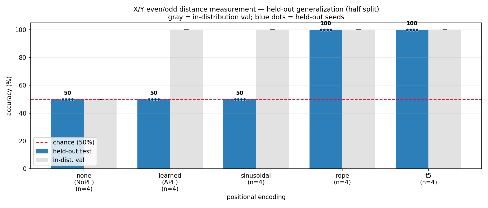
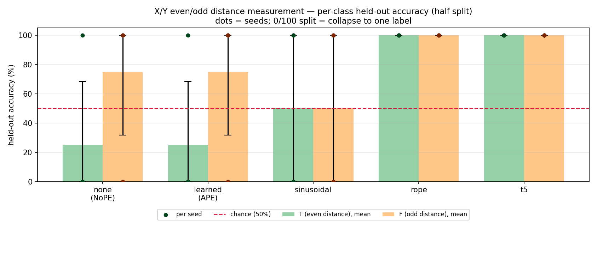
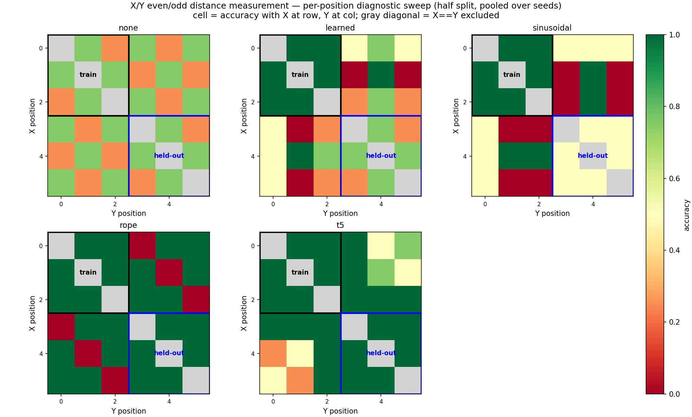

# Small Even/Odd Distance Measurement Task - No Colon

*2026-07-02 - John Lee*

## Config

| item | value |
|---|---|
| directory | `generalization-evenodd-distance-measurement-small/` |
| config | `config/no_colon.py` |
| input | six tokens only, no `:` |
| task | decide whether the X/Y distance is even or odd |
| train/val positions | `X` and `Y` only in `0,1,2` |
| held-out positions | `X` and `Y` only in `3,4,5` |
| labels | `T` = even distance, `F` = odd distance |
| model | 3 layers, 2 heads, 32 dim, about 0.04M params |
| mask | `causal=False` |
| seeds | `1337`, `2024`, `31415`, `27182` |
| PEs | `none`, `learned`, `sinusoidal`, `rope`, `t5` |

## Commands

```bash
cd generalization-evenodd-distance-measurement-small
../venv/bin/python data/evenodd_distance/prepare.py

for seed in 1337 2024 31415 27182; do
  for pe in none learned sinusoidal rope t5; do
    ../venv/bin/python train.py config/no_colon.py --seed=$seed --pos_type=$pe
    ../venv/bin/python evaluate.py config/no_colon.py \
      --results_csv=results_no_colon_lateststyle.csv \
      --predictions_csv=predictions_no_colon_lateststyle.csv \
      --show_errors=0
  done
done

../venv/bin/python plot_latest_commit_style.py --split=half \
  --results_csv=results_no_colon_lateststyle.csv \
  --predictions_csv=predictions_no_colon_lateststyle.csv \
  --out_dir=log/figures/no_colon
```

## Task

This is **not** relative order. `X` and `Y` both stay in the string. The model answers
whether their distance is even or odd.

```text
T iff abs(index(X) - index(Y)) is even
F iff abs(index(X) - index(Y)) is odd
```

Example:

```text
XOYOOO:T
X at 0, Y at 2 -> distance 2 -> even -> T
```

The train/test split is by **position**, not length. Every input has length 6.

| pool | positions allowed for X/Y | examples |
|---|---|---:|
| train | `0,1,2` | 600 |
| val | `0,1,2` | 120 |
| held-out test | `3,4,5` | 120 |

All pools are balanced: 50% `T`, 50% `F`.

## Hypothesis

| PE | expected result | why |
|---|---|---|
| `none` | fail | no position information |
| `learned` | learn train, fail held-out | can memorize seen positions |
| `sinusoidal` | learn train, fail held-out | still uses absolute positions |
| `rope` | generalize | uses relative position information |
| `t5` | generalize | uses relative position information |

## Results

Mean +/- standard deviation over 4 seeds. Chance is 50%.

| PE | val | held-out | held-out by seed |
|---|---:|---:|---|
| `none` | 50.0 +/- 0.0 | 50.0 +/- 0.0 | 50, 50, 50, 50 |
| `learned` | 100.0 +/- 0.0 | 50.0 +/- 0.0 | 50, 50, 50, 50 |
| `sinusoidal` | 100.0 +/- 0.0 | 50.0 +/- 0.0 | 50, 50, 50, 50 |
| `rope` | 100.0 +/- 0.0 | 100.0 +/- 0.0 | 100, 100, 100, 100 |
| `t5` | 100.0 +/- 0.0 | 100.0 +/- 0.0 | 100, 100, 100, 100 |

**Figure 1 - Held-out vs validation accuracy.**
Learned/sinusoidal have high validation accuracy but chance held-out
accuracy, while RoPE/T5 are high on both.



**Figure 2 - Held-out accuracy by class.**
This shows whether a 50% model is just predicting one label.



**Figure 3 - Per-position diagnostic heatmap.**
The train block is positions `0,1,2`; the held-out block is
positions `3,4,5`. RoPE/T5 stay correct in the held-out block.



## Main Takeaway

No-colon matches the hypothesis.

- NoPE does not learn.
- Learned and sinusoidal learn the train positions but fail held-out positions.
- RoPE and simplified T5 generalize perfectly.

## Interpretation

NoPE sees only the symbols `X`, `Y`, and `O`; without positions, it cannot measure
distance.

Learned and sinusoidal PEs can solve the task in positions `0,1,2`, but they do not
transfer to positions `3,4,5`.

RoPE and simplified T5 use relative position information, so the learned even/odd rule
transfers to the held-out block.

## T5 Implementation Note

This is not full T5. The only T5-style change is a **relative attention bias**.

What changed:

- No absolute position embedding is added.
- Q/K/V, MLP, classifier head, and training loop are unchanged.
- Attention gets one learned bias value based on relative distance:

```text
relative_position = key_index - query_index
bucket = relative_position + (block_size - 1)
attention_score += learned_bias[bucket, head]
```

Where to find it:

- `pos_encoding.py`, lines 132-158: `T5RelativeBias`
- `pos_encoding.py`, lines 161-172: `pos_type == 't5'` creates `T5RelativeBias`
- `model.py`, lines 72-75: attention computes scores, gets the bias, and adds it

For no-colon input, `block_size=6`, so T5 has:

```text
2 * 6 - 1 = 11 relative-distance buckets
11 buckets * 2 heads = 22 scalar bias parameters
```

This follows the meeting note: "individual bucket for every offset, not logarithmic."
In code, every relative offset gets its own learned bucket.

## Caveats

- Tiny sanity check only.
- One split only: `0,1,2 -> 3,4,5`.
- Inside each half, only distances 1 and 2 occur.
- Simplified T5 relative bias, not full T5.
