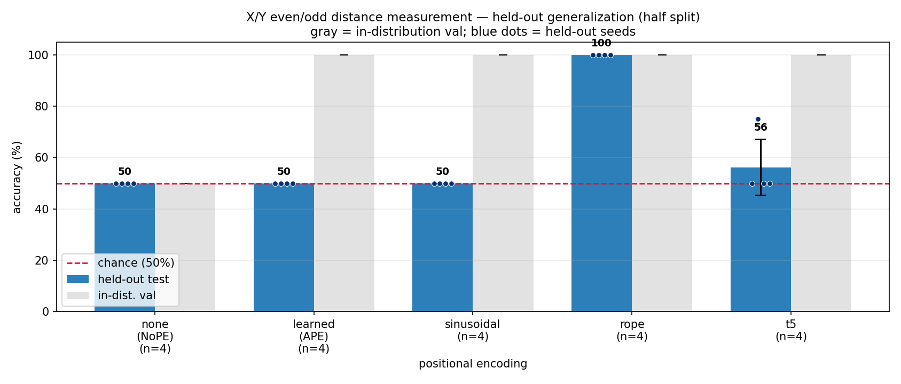
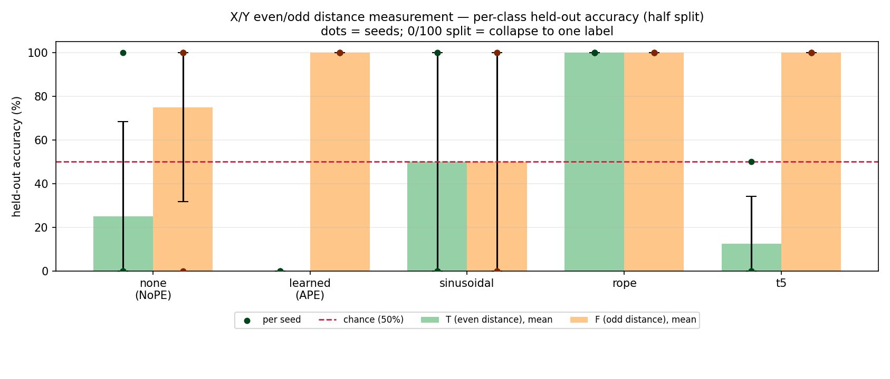
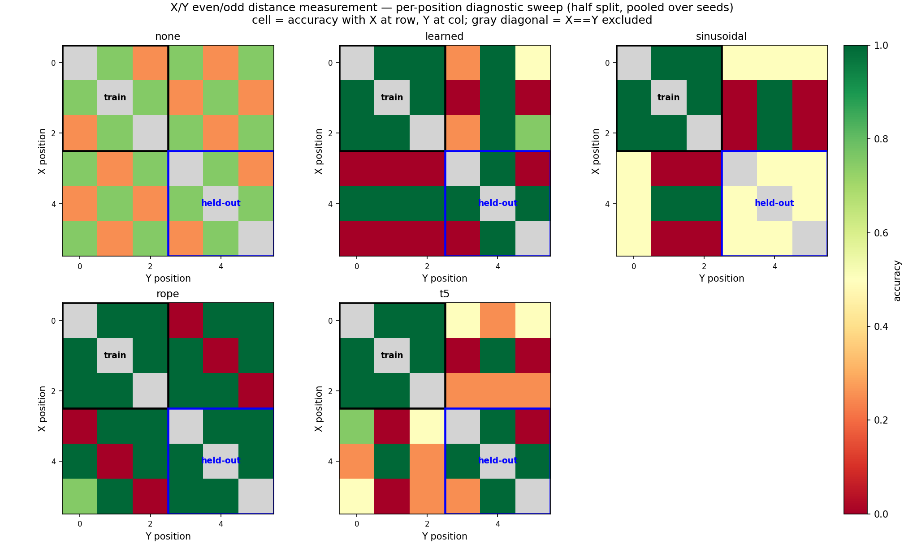

# Small Even/Odd Distance Measurement Task - With Colon

*2026-07-02 - John Lee*

## Config

This is the same task as no-colon, but the model also sees a fixed final `:` token.

| item | value |
|---|---|
| directory | `generalization-evenodd-distance-measurement-small/` |
| config | `config/with_colon.py` |
| input | six tokens plus final `:` |
| task | decide whether the X/Y distance is even or odd |
| train/val positions | `X` and `Y` only in `0,1,2` |
| held-out positions | `X` and `Y` only in `3,4,5` |
| labels | `T` = even distance, `F` = odd distance |
| model | 3 layers, 2 heads, 32 dim, about 0.04M params |
| mask | `causal=False` |
| seeds | `1337`, `2024`, `31415`, `27182` |
| PEs | `none`, `learned`, `sinusoidal`, `rope`, `t5` |

## Commands

```bash
cd generalization-evenodd-distance-measurement-small
../venv/bin/python data/evenodd_distance/prepare.py

for seed in 1337 2024 31415 27182; do
  for pe in none learned sinusoidal rope t5; do
    ../venv/bin/python train.py config/with_colon.py --seed=$seed --pos_type=$pe
    ../venv/bin/python evaluate.py config/with_colon.py \
      --results_csv=results_with_colon.csv \
      --predictions_csv=predictions_with_colon.csv \
      --show_errors=0
  done
done

../venv/bin/python plot_latest_commit_style.py --split=half \
  --results_csv=results_with_colon_lateststyle.csv \
  --predictions_csv=predictions_with_colon_lateststyle.csv \
  --out_dir=log/figures/with_colon
```

## Task

The label is still based only on the distance between `X` and `Y`.

```text
T iff abs(index(X) - index(Y)) is even
F iff abs(index(X) - index(Y)) is odd
```

Example:

```text
stored example: XOYOOO:T
model input:    XOYOOO:
X at 0, Y at 2 -> distance 2 -> even -> T
```

The final `:` is visible to the model, but it is **not** part of the distance.

## Hypothesis

| PE | expected result | why |
|---|---|---|
| `none` | fail | no position information |
| `learned` | learn train, fail held-out | can memorize seen positions |
| `sinusoidal` | learn train, fail held-out | still uses absolute positions |
| `rope` | generalize | X/Y distance should still be available |
| `t5` | uncertain | relative distances help, but `:` may create a shortcut |

## Results

Mean +/- standard deviation over 4 seeds. Chance is 50%.

| PE | val | held-out | held-out by seed |
|---|---:|---:|---|
| `none` | 50.0 +/- 0.0 | 50.0 +/- 0.0 | 50, 50, 50, 50 |
| `learned` | 100.0 +/- 0.0 | 50.0 +/- 0.0 | 50, 50, 50, 50 |
| `sinusoidal` | 100.0 +/- 0.0 | 50.0 +/- 0.0 | 50, 50, 50, 50 |
| `rope` | 100.0 +/- 0.0 | 100.0 +/- 0.0 | 100, 100, 100, 100 |
| `t5` | 100.0 +/- 0.0 | 56.2 +/- 10.8 | 50, 75, 50, 50 |

**Figure 1 - Held-out vs validation accuracy.**
What to look for: T5 has 100% validation accuracy but poor held-out accuracy, so it
learns the train positions but does not transfer well with the final `:` present.



**Figure 2 - Held-out accuracy by class.**
What to look for: T5's failure is mostly a class-specific collapse, not random noise.



**Figure 3 - Per-position diagnostic heatmap.**
What to look for: RoPE stays correct in the held-out block, while T5 becomes unreliable
after adding the final `:` marker.



## Main Takeaway

Adding `:` changes simplified T5, but not RoPE.

- RoPE stays at 100% held-out accuracy.
- T5 learns the train positions, but held-out accuracy drops to `56.2 +/- 10.8`.
- Learned and sinusoidal still fail held-out generalization.
- NoPE still does not learn.

## Interpretation

The final `:` gives the model a fixed marker. A position in `0,1,2` has a different
distance to `:` than a position in `3,4,5`.

RoPE still learns the X/Y distance rule and transfers it.

Simplified T5 may be using the final `:` as a shortcut. It gets 100% validation accuracy,
but usually falls to chance on held-out positions.

## T5 Implementation Note

This is not full T5. The only T5-style change is a **relative attention bias**.

What changed:

- No absolute position embedding is added.
- Q/K/V, MLP, classifier head, and training loop are unchanged.
- Attention gets one learned bias value based on relative distance:

```text
relative_position = key_index - query_index
bucket = relative_position + (block_size - 1)
attention_score += learned_bias[bucket, head]
```

Where to find it:

- `pos_encoding.py`, lines 132-158: `T5RelativeBias`
- `pos_encoding.py`, lines 161-172: `pos_type == 't5'` creates `T5RelativeBias`
- `model.py`, lines 69-73: attention computes scores, gets the bias, and adds it

For with-colon input, `block_size=7`, so T5 has:

```text
2 * 7 - 1 = 13 relative-distance buckets
13 buckets * 2 heads = 26 scalar bias parameters
```

This follows the meeting note: "individual bucket for every offset, not logarithmic."
In code, every relative offset gets its own learned bucket.

## Caveats

- Tiny sanity check only.
- One split only: `0,1,2 -> 3,4,5`.
- Inside each half, only distances 1 and 2 occur.
- Simplified T5 relative bias, not full T5.
