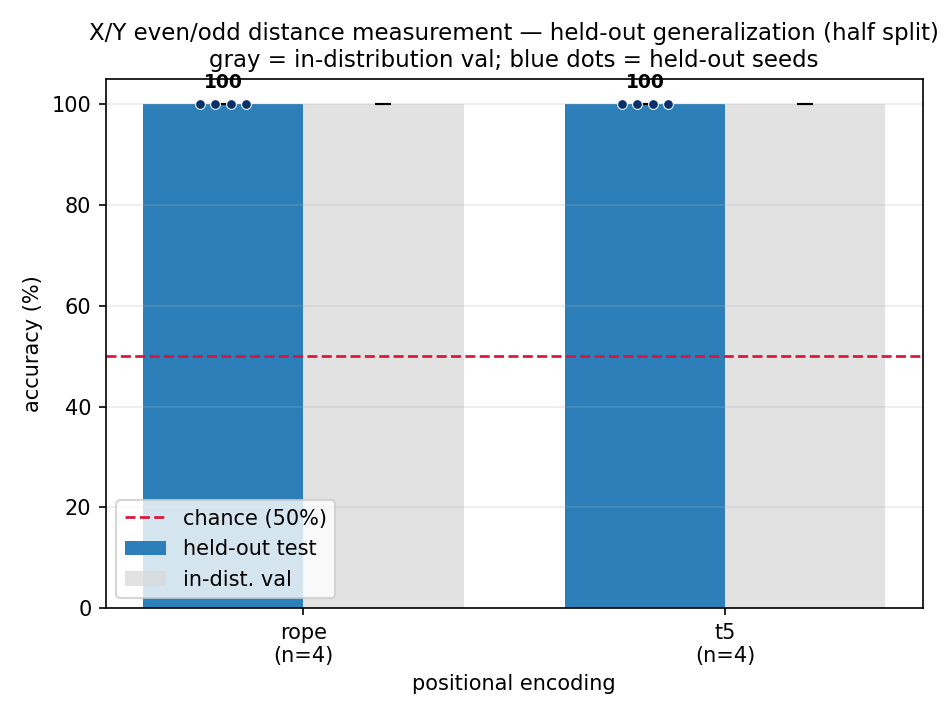
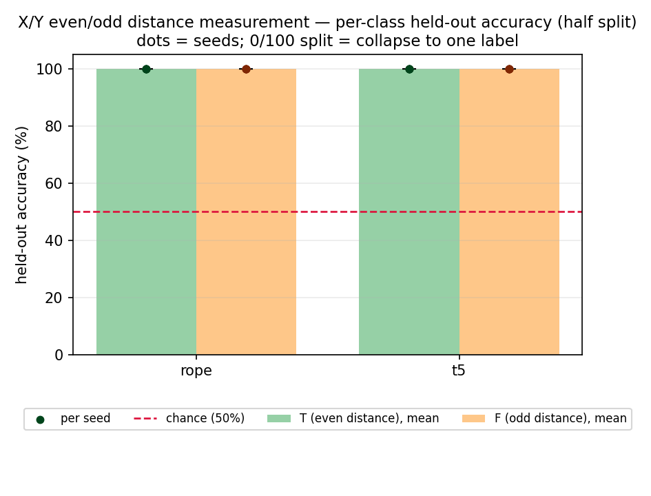
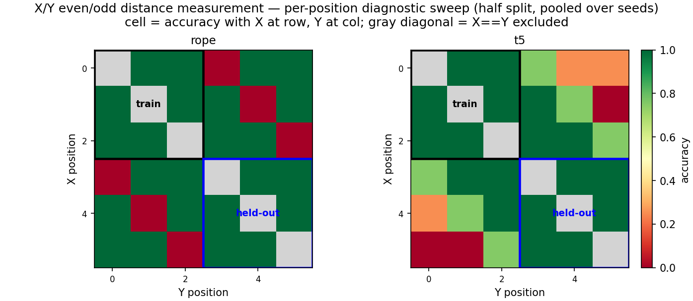

# Colon Anchor Ablations - RoPE vs T5

*2026-07-04 - John Lee*

## Question

Prof. MacCormick noted that the main results matched the hypothesis, except for the
weird T5 behavior when a final `:` was added. These follow-ups check whether the `:`
token is acting like a fixed positional anchor for T5.

## Setup

Same small even/odd distance measurement task:

```text
T iff abs(index(X) - index(Y)) is even
F iff abs(index(X) - index(Y)) is odd
```

First, I changed the marker position:

| condition | model input example |
|---|---|
| `no_colon` | `XOYOOO` |
| `with_colon` | `XOYOOO:` |
| `front_colon` | `:XOYOOO` |

Then I added one masking condition:

| condition | model input example | attention behavior |
|---|---|---|
| `with_colon_masked` | `XOYOOO:` | body tokens cannot attend to the final `:` key |

These follow-ups only rerun `rope` and `t5`, because those are the two relative-position
methods relevant to the weird behavior.

## Commands

```bash
cd generalization-evenodd-distance-measurement-small

for seed in 1337 2024 31415 27182; do
  for pe in rope t5; do
    ../venv/bin/python train.py config/front_colon.py --seed=$seed --pos_type=$pe
    ../venv/bin/python evaluate.py config/front_colon.py \
      --results_csv=results_front_colon.csv \
      --predictions_csv=predictions_front_colon.csv \
      --show_errors=0
  done
done

for seed in 1337 2024 31415 27182; do
  for pe in rope t5; do
    ../venv/bin/python train.py config/with_colon_masked.py --seed=$seed --pos_type=$pe
    ../venv/bin/python evaluate.py config/with_colon_masked.py \
      --results_csv=results_with_colon_masked.csv \
      --predictions_csv=predictions_with_colon_masked.csv \
      --show_errors=0
  done
done
```

## Results

Held-out accuracy, mean +/- std over 4 seeds:

| condition | RoPE | T5 |
|---|---:|---:|
| `no_colon` | 100.0 +/- 0.0 | 100.0 +/- 0.0 |
| `with_colon` | 100.0 +/- 0.0 | 56.2 +/- 10.8 |
| `front_colon` | 100.0 +/- 0.0 | 68.8 +/- 20.7 |
| `with_colon_masked` | 100.0 +/- 0.0 | 100.0 +/- 0.0 |

For `front_colon`, T5 held-out accuracy by seed was:

```text
50, 100, 50, 75
```

For `with_colon_masked`, T5 held-out accuracy by seed was:

```text
100, 100, 100, 100
```

**Figure 1 - Front-colon held-out vs validation accuracy.**
What to look for: RoPE stays perfect, while T5 becomes seed-sensitive when the marker
is moved to the front.


**Figure 2 - Front-colon held-out accuracy by class.**
What to look for: this shows which label T5 collapses on in the seeds where it fails.


**Figure 3 - Front-colon per-position heatmap.**
What to look for: the failure pattern changes when the fixed marker moves from the end
to the front.


**Figure 4 - Masked-colon held-out vs validation accuracy.**
What to look for: T5 returns to 100% when the final `:` is still present but cannot be
attended to by body tokens.



**Figure 5 - Masked-colon held-out accuracy by class.**
What to look for: both T/even and F/odd recover to 100% for T5.



**Figure 6 - Masked-colon per-position heatmap.**
What to look for: masking attention to the marker removes the held-out failure pattern.



## Takeaway

The result strongly supports the anchor hypothesis.

RoPE is stable no matter where the `:` marker is placed. T5 is not: it is perfect with no
marker, weak with the marker at the end, and seed-sensitive with the marker at the front.

Most importantly, T5 returns to 100% when the final `:` is still present but body tokens
cannot attend to it. So the issue is not simply sequence length 7. The issue appears to be
T5's ability to use the visible `:` marker as an extra position cue.

## Caveat

This does not prove the exact internal mechanism, but it is stronger evidence than the
position ablation alone: masking attention to the marker removes the failure.
