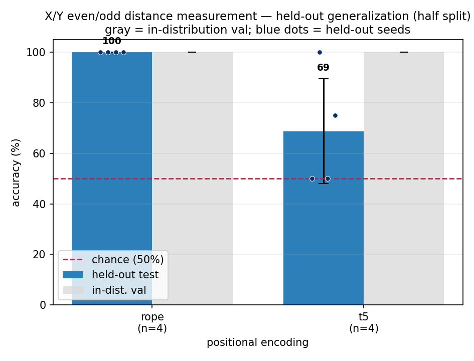
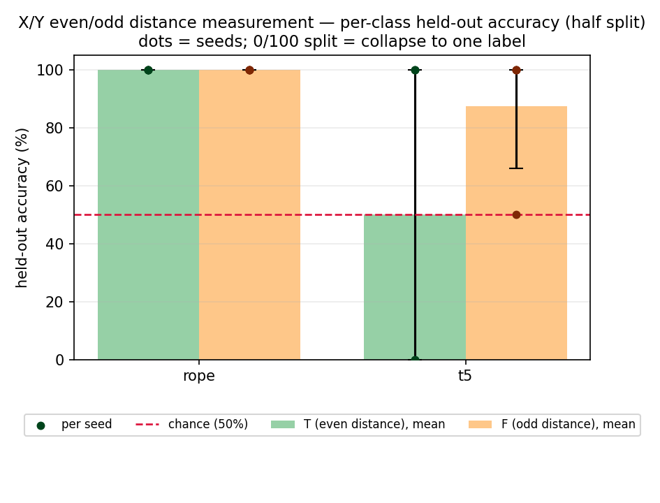
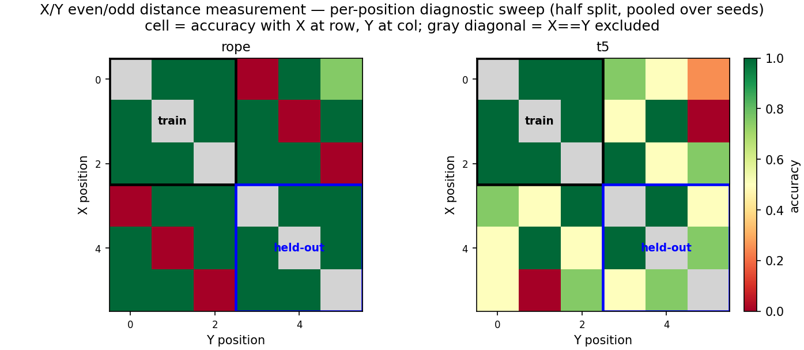

# Colon Position Ablation - RoPE vs T5

*2026-07-04 - John Lee*

## Question

Prof. MacCormick noted that the main results matched the hypothesis, except for the
weird T5 behavior when a final `:` was added. This follow-up checks whether the `:`
token is acting like a fixed positional anchor for T5.

## Setup

Same small even/odd distance measurement task:

```text
T iff abs(index(X) - index(Y)) is even
F iff abs(index(X) - index(Y)) is odd
```

Only the marker position changes:

| condition | model input example |
|---|---|
| `no_colon` | `XOYOOO` |
| `with_colon` | `XOYOOO:` |
| `front_colon` | `:XOYOOO` |

This follow-up only reruns `front_colon` for `rope` and `t5`, because those are the two
relative-position methods relevant to the weird behavior.

## Commands

```bash
cd generalization-evenodd-distance-measurement-small

for seed in 1337 2024 31415 27182; do
  for pe in rope t5; do
    ../venv/bin/python train.py config/front_colon.py --seed=$seed --pos_type=$pe
    ../venv/bin/python evaluate.py config/front_colon.py \
      --results_csv=results_front_colon.csv \
      --predictions_csv=predictions_front_colon.csv \
      --show_errors=0
  done
done
```

## Results

Held-out accuracy, mean +/- std over 4 seeds:

| condition | RoPE | T5 |
|---|---:|---:|
| `no_colon` | 100.0 +/- 0.0 | 100.0 +/- 0.0 |
| `with_colon` | 100.0 +/- 0.0 | 56.2 +/- 10.8 |
| `front_colon` | 100.0 +/- 0.0 | 68.8 +/- 20.7 |

For `front_colon`, T5 held-out accuracy by seed was:

```text
50, 100, 50, 75
```







## Takeaway

The result supports the anchor hypothesis.

RoPE is stable no matter where the `:` marker is placed. T5 is not: it is perfect with no
marker, weak with the marker at the end, and seed-sensitive with the marker at the front.

This suggests the simplified T5 relative bias may use the fixed `:` token as an extra
position cue instead of learning only the X/Y distance rule.

## Caveat

This does not prove the mechanism. It is a small diagnostic result showing that T5 is
sensitive to the presence and location of an irrelevant fixed marker.
