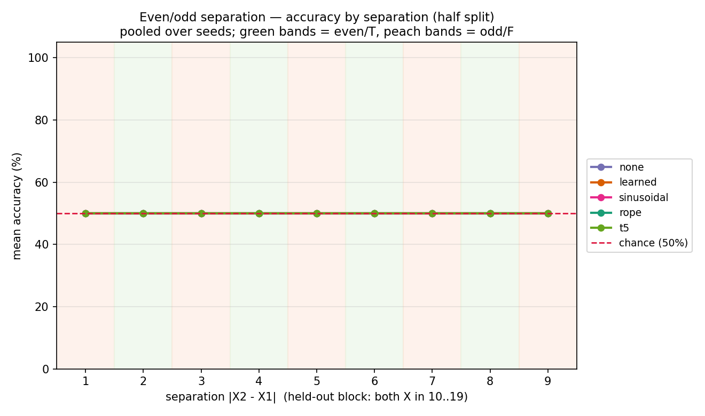

# Even/odd separation — a capacity wall below the PE comparison (Phase 3, distance task #1)

*2026-06-25 · commit `<pending>` · John Lee*

> **Bottom line.**
>
> 1. A micro-transformer (<1M params) **cannot learn even/odd distance-parity at all** —
>    every PE, every seed sits at exactly 50% on *in-distribution* val (loss locked at
>    ln 2), so the intended NoPE-vs-distance held-out comparison is moot at micro scale.
> 2. The task is genuinely learnable, though: a deliberately oversized 4.76M model reaches
>    **100% in-distribution** in ~2000 iters — making this a **capacity wall**, not a
>    degenerate task.
> 3. At that learnable scale, absolute PE (`learned`) **learns the task but fails to
>    generalize** to held-out positions (44.85%, below chance) — the same
>    "learns-but-doesn't-generalize" signature seen on relative order, now on a *distance*
>    task.

### The task

- **Input** — a fixed string of **20 characters**. The symbol `X` appears
  **exactly twice** (no `Y`; the two targets are identical); the other 18 are
  random digits.
- **Distance** — `|pos2 − pos1|`, how far apart the two `X`'s are.
- **Label** — `T` if that distance is **even**, `F` if it is **odd**.

```
482X50178X4019285746 : T     X at 3 and 9  →  distance 6 (even)  →  T
482X5017X64019285746 : F     X at 3 and 8  →  distance 5 (odd)   →  F
```

The five positional encodings compared (the one knob that changes, `pos_type`):

- `none` — **NoPE**: no positional encoding at all
- `learned`, `sinusoidal` — **absolute** PE (encodes each fixed slot)
- `rope`, `t5` — **relative / distance-aware** PE (encodes the gap between positions)

Even/odd of a difference is the XOR of the two position-parities, so the task reduces to
*"are the two X's on positions of the same parity?"* — a parity-flavored function.

---

## Setup  <!-- R1/R3/R6 -->

- **data:** length 20, two `X`'s; pools 50k train / 5k val / 2k test, all **50/50 T/F**
  (chance = 50%).
- **split (`half`):** train/val both X in 0–9; held-out test both X in 10–19. The held-out
  test is **distance-balanced** (distances 2/4/6/8 → 250 each, 1/3/5/7/9 → 200 each).
- **checks:** `prepare.py` asserts label-correctness (`|pos2−pos1|` even iff T) and the
  split rule.
- **model:** the micro baseline — `n_layer=4, n_head=4, n_embd=128` (**0.80M params**),
  `block_size=64`.
- **optimizer / schedule:** AdamW · `lr=1e-3` cosine · `max_iters=2000` · `batch_size=64`.
- **loss / device:** answer-token-only loss · CPU.
- **seeds:** 1337–1340 (vary model init + batch order only; **one fixed data split**).
- **env:** python 3.9.6 · torch 2.8.0 · numpy 2.0.2 · matplotlib 3.9.4; data `SEED=1337`.
- **reproduce:**
  ```bash
  ../venv/bin/python data/evenodd/prepare.py
  for pe in none learned sinusoidal rope t5; do for s in 1337 1338 1339 1340; do
    ../venv/bin/python train.py    config/basic.py --pos_type=$pe --seed=$s
    ../venv/bin/python evaluate.py config/basic.py --pos_type=$pe --seed=$s
  done; done
  ../venv/bin/python plot.py --split=half --out_dir=log/figures
  ../venv/bin/python plot.py --split=half --separation --out_dir=log/figures
  ```

---

## Results  <!-- R5/R7/R9 -->

### 1. Micro-scale PE sweep (the planned experiment) — **uniform null**

All 20 runs (5 PE × 4 seeds) collapse to a single label; **in-distribution val is also
50%**, so nothing was learned even on the training region.

| PE | in-dist. val acc | held-out test acc | held-out per-class |
|----|------------------|-------------------|--------------------|
| `none` | 50.0% | 50.0% | 100/0 or 0/100 (seed-dependent collapse) |
| `learned` | 50.0% | 50.0% | 100/0 or 0/100 |
| `sinusoidal` | 50.0% | 50.0% | 100/0 or 0/100 |
| `rope` | 50.0% | 50.0% | 100/0 or 0/100 |
| `t5` | 50.0% | 50.0% | 100/0 or 0/100 |

Because val never exceeds chance, the held-out columns carry no generalization signal —
the held-out accuracy is just *which label the run collapsed to* crossed with the test
class balance.

### 2. Is it learnable? Diagnostics (single seed 1337, in-distribution val)

| diagnostic | params | iters | lr | best in-dist. val |
|------------|-------:|------:|----|-------------------|
| micro `learned` | 0.80M | **15 000** | 1e-3 | **50.0%** |
| micro `rope` | 0.80M | **15 000** | 1e-3 | **50.0%** |
| micro `learned` | 0.80M | 8 000 | **3e-3** | **50.0%** |
| **big `learned`** (`n_layer=6, n_head=8, n_embd=256`) | **4.76M** | 8 000 | 1e-3 | **100.0%** (by iter ~2000, val loss → 0.0000) |

More iterations (7.5×) and a higher learning rate do **not** move the micro model off 50%;
a ~6× larger model learns it cleanly. **→ capacity wall**, between 0.80M and 4.76M.

### 3. Does the learnable (4.76M) model *generalize*? — **no**

Evaluating the 4.76M `learned` checkpoint on the held-out second half:

| | in-dist. val | held-out test | T (even) | F (odd) |
|--|--------------|---------------|----------|---------|
| 4.76M `learned` (absolute PE) | **100.0%** | **44.85%** (below chance) | 5.9% | 83.8% |

High val + below-chance held-out = **learned the task, did not generalize** — and collapsed
toward one label off-distribution. This mirrors the relative-order result (absolute PE ties
the computation to absolute slot identities seen in training) — here on a *distance* task.

**Figures** (micro sweep; from `results.csv` / `predictions.csv` via `plot.py`):



*All five methods lie exactly on the chance line at every separation (per-distance n shown,
80–720 pooled over seeds) — the collapsed signature of "nothing learned."*

The other three figures (in `figures/`) tell the same story:

- `heldout_accuracy_half.png` — every method at 50% held-out **and** 50% val.
- `heldout_perclass_half.png` — the bimodal 0/100 per-class collapse.
- `per_position_half.png` — the per-position heatmap averages to ~50% per cell.

---

## Why / interpretation

- **Capacity wall, not a bad task.** The loss snaps to ln 2 within 1000 iters and never
  moves at micro scale, regardless of PE / iters / lr — the optimizer finds the trivial
  50/50 predictor and the gradient toward the parity solution is too weak to escape. A
  4.76M model finds the solution easily, so the function is well-defined and learnable; the
  <1M budget is simply below the threshold for *this* computation.
- **Why even/odd is so much harder than relative order.** Order is readable straight off
  the causal mask ("have I already seen an X?") — a monotone signal. Parity-of-distance
  requires representing position-parity and an exact equality/XOR over the two X's; it has
  no monotone shortcut. *Hypothesis* (parity is known-hard for transformers): worth checking
  against the literature before relying on it — **not yet read, so not cited here.**
- **Absolute PE doesn't generalize across positions (4.76M datapoint).** Consistent with the
  relative-order finding: absolute slot identities learned in the first half don't transfer
  to the unseen second half. The *relative* family (none/rope/t5) at the learnable scale is
  the missing comparison — see Next.

## Caveats / limitations

- **One fixed data split**; the 4 seeds vary only init + batch order. (Same caveat as the
  order sweep.) For the micro null this barely matters — nothing learned under any seed.
- The 4.76M results are **single-seed, single-PE diagnostics** (`learned` only), run to
  answer "is it learnable / does absolute PE generalize," **not** a controlled sweep. They
  intentionally **break the project's <1M micro constraint** and are labeled as such.
- The intended scientific comparison — does **NoPE fail** (can't count distance) while
  **rope/t5** hold up, at the scale where the task is learnable — is **deferred, not
  answered.** MacCormick's predicted accuracy-vs-separation shape cannot be read from a model
  that never learned the task.

## Relation to prior work

The "absolute-PE-learns-but-doesn't-generalize-to-held-out-positions" pattern reproduces the
relative-order result in this repo. The broader parity-hardness framing is left as a
hypothesis pending a literature check (no unread papers cited).

## Next

1. **Decide the path** (raised with advisor): (a) run the PE sweep at the learnable ~4.76M
   scale — above-micro, clearly flagged — to finally test NoPE-fails / distance-wins and
   produce the real separation figure; (b) **find the minimal capacity** that learns even/odd
   (binary-search 0.8M↔4.76M; a Phase-4 "minimal model" result); (c) **scratchpad tokens**
   (Phase 5) to crack it *within* <1M; or (d) pivot to the easier **dist≥D** task, which may
   fit under the micro budget.
2. Whichever path: regenerate data **per seed** to upgrade the variance estimate.
