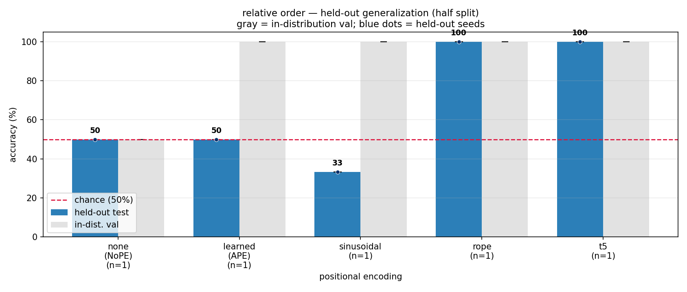
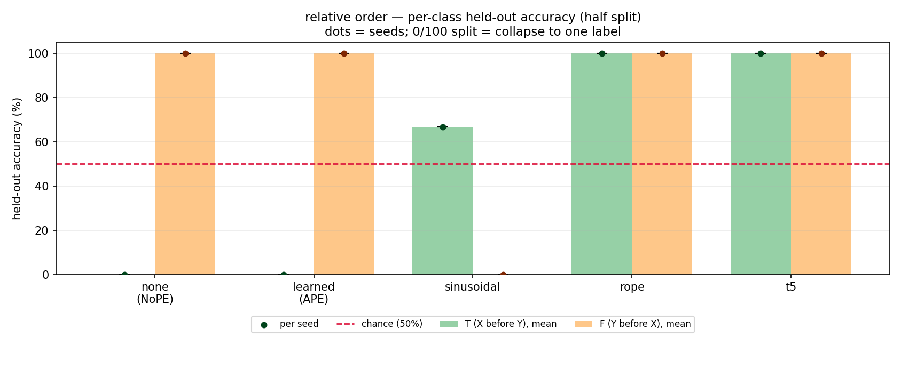
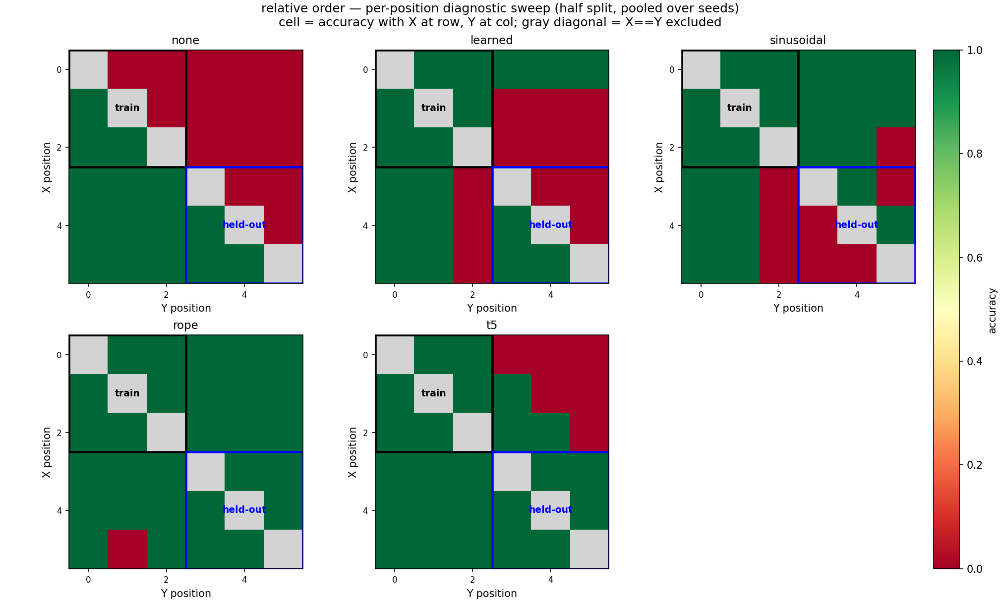

# Tiny Non-Causal Order, Body-Only Input

Date: 2026-07-02

Purpose: clean advisor sanity check with no fixed delimiter anchor in the transformer
input.

Setup:
- input to model: six body tokens only, e.g. `OOXYOO`
- data file remains readable as `<body>:<label>`, but `:` is not fed to the model
- label: `T` iff `index(X) < index(Y)`, else `F`
- train/val positions: `0,1,2`
- held-out test positions: `3,4,5`
- `causal=False`
- classifier head: mean-pool body hidden states, then `Linear(n_embd, 2)`
- model: `n_embd=32`, `n_head=2`, `n_layer=3`
- seed: `1337`
- iterations: `2000`

Command:

```bash
../venv/bin/python data/order/prepare.py
for pe in none learned sinusoidal rope t5; do
  ../venv/bin/python train.py config/body_only.py --pos_type=$pe
  ../venv/bin/python evaluate.py config/body_only.py \
    --results_csv=results_body_only.csv \
    --predictions_csv=predictions_body_only.csv
done
../venv/bin/python plot_latest_commit_style.py --split=half \
  --results_csv=results_body_only_lateststyle.csv \
  --predictions_csv=predictions_body_only_lateststyle.csv \
  --out_dir=log/figures/body_only
```

The `*_lateststyle.csv` files are schema adapters for the latest committed plotting
code style: `small_half` is renamed to `half`, and prediction columns are renamed from
`x_pos/y_pos` to `x1_pos/x2_pos`.

Results:

| PE | val | held-out | held-out T | held-out F |
|----|-----|----------|------------|------------|
| `none` | 50.0% | 50.0% | 0.0% | 100.0% |
| `learned` | 100.0% | 50.0% | 0.0% | 100.0% |
| `sinusoidal` | 100.0% | 33.3% | 66.7% | 0.0% |
| `rope` | 100.0% | 100.0% | 100.0% | 100.0% |
| `t5` | 100.0% | 100.0% | 100.0% | 100.0% |

Figures:







Takeaway:

This is the clean result matching the meeting hypothesis: NoPE cannot learn the
position-dependent task, absolute PEs learn the training positions but fail on held-out
positions, and relative PEs (`rope`, simplified `t5`) transfer.

T5 implementation note:

The `t5` condition is a simplified T5-style relative attention bias. It uses one exact
bucket per relative offset:

```text
relative_position = key_index - query_index
bucket = relative_position + (block_size - 1)
```

With body-only input, `block_size=6`, so this gives `2 * 6 - 1 = 11` buckets. With
`n_head=2`, the T5 bias adds `11 * 2 = 22` trainable scalar bias parameters. This is
not full T5; it is only the relative attention-bias mechanism.
