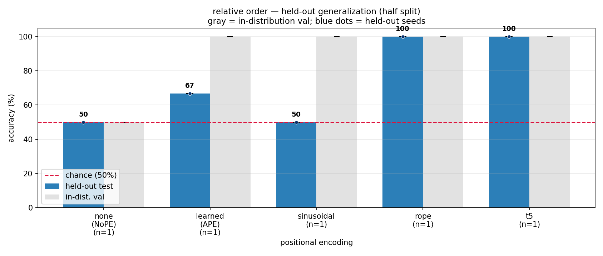
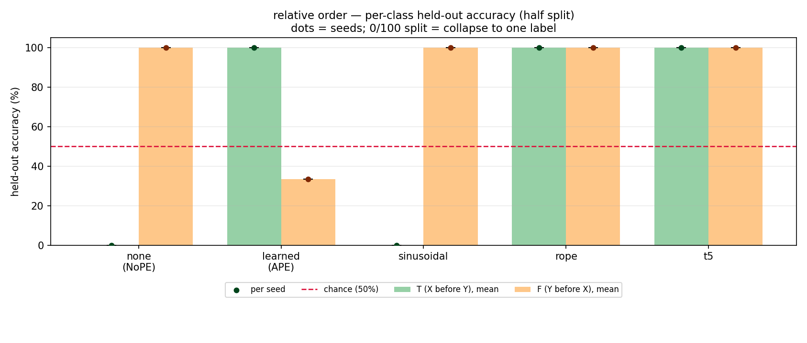
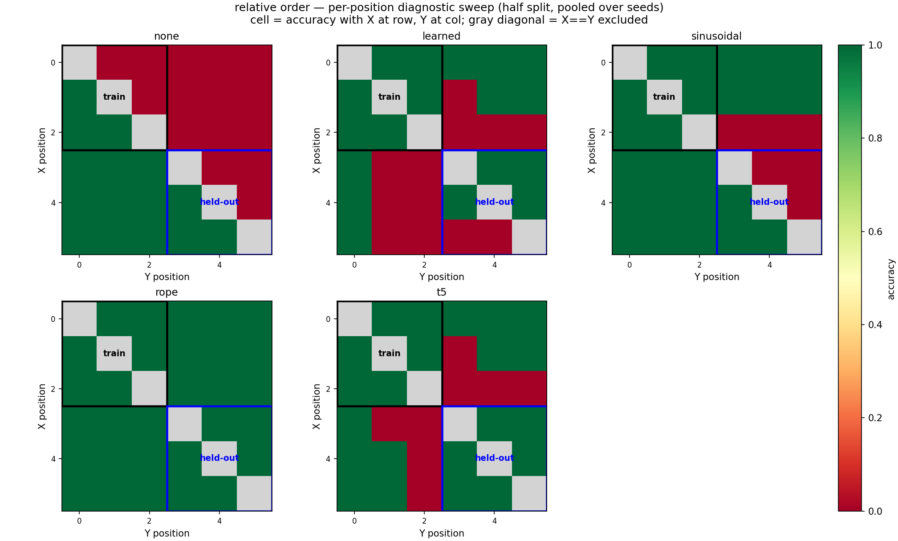

# Tiny Non-Causal Order, Body Plus Colon Input

Date: 2026-07-02

Purpose: compare against the body-only setup by including the fixed final `:` token in
the transformer attention context.

Setup:
- input to model: seven tokens, e.g. `OOXYOO:`
- classifier still pools only over the six body-token hidden states
- `:` is included only as an attention-context token
- label: `T` iff `index(X) < index(Y)`, else `F`
- train/val positions: `0,1,2`
- held-out test positions: `3,4,5`
- `causal=False`
- classifier head: mean-pool body hidden states, then `Linear(n_embd, 2)`
- model: `n_embd=32`, `n_head=2`, `n_layer=3`
- seed: `1337`
- iterations: `2000`

Command:

```bash
../venv/bin/python data/order/prepare.py
for pe in none learned sinusoidal rope t5; do
  ../venv/bin/python train.py config/body_plus_colon.py --pos_type=$pe
  ../venv/bin/python evaluate.py config/body_plus_colon.py \
    --results_csv=results_body_plus_colon.csv \
    --predictions_csv=predictions_body_plus_colon.csv
done
../venv/bin/python plot_latest_commit_style.py --split=half \
  --results_csv=results_body_plus_colon_lateststyle.csv \
  --predictions_csv=predictions_body_plus_colon_lateststyle.csv \
  --out_dir=log/figures/body_plus_colon
```

The `*_lateststyle.csv` files are schema adapters for the latest committed plotting
code style: `small_half` is renamed to `half`, and prediction columns are renamed from
`x_pos/y_pos` to `x1_pos/x2_pos`.

Results:

| PE | val | held-out | held-out T | held-out F |
|----|-----|----------|------------|------------|
| `none` | 50.0% | 50.0% | 0.0% | 100.0% |
| `learned` | 100.0% | 66.7% | 100.0% | 33.3% |
| `sinusoidal` | 100.0% | 50.0% | 0.0% | 100.0% |
| `rope` | 100.0% | 100.0% | 100.0% | 100.0% |
| `t5` | 100.0% | 100.0% | 100.0% | 100.0% |

Figures:







Takeaway:

Adding `:` changes the absolute-PE failure pattern: `learned` rises from 50.0% to
66.7% held-out, and `sinusoidal` rises from 33.3% to 50.0%. The relative PEs still
transfer at 100%. This suggests the delimiter can affect the learned shortcut/failure
mode, so the body-only setup is the cleaner sanity check for the advisor hypothesis.

T5 implementation note:

The `t5` condition is the same simplified T5-style relative attention bias as in the
body-only log. With `body_plus_colon`, `block_size=7`, so there are `2 * 7 - 1 = 13`
exact-offset buckets. With `n_head=2`, the T5 bias adds `13 * 2 = 26` trainable scalar
bias parameters. This is not full T5; it is only the relative attention-bias mechanism.
