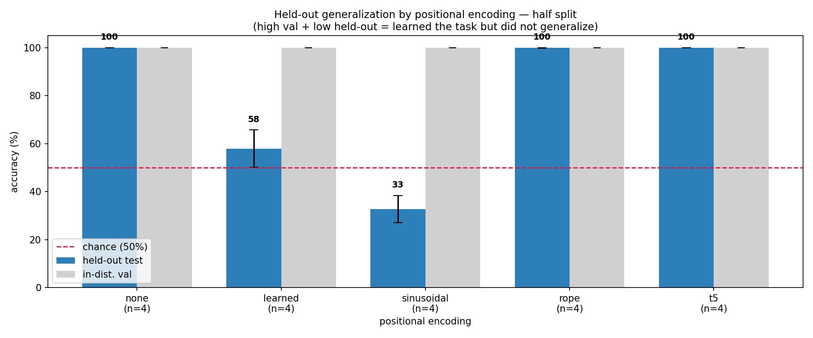

# Generalization Experiment: Relative-Order Task
**Date:** June 20, 2026

This experiment trains a micro-transformer (<1M params) on a **relative-order** task
and (later) measures whether it generalizes to symbol *position pairs* it never saw
during training. It reuses the from-scratch swappable-PE engine built for the
detection task (`model.py` + `pos_encoding.py`); only the data and config are
task-specific.

> **Critical framing — this is NOT length generalization.** Every input is exactly
> `LENGTH = 20` characters. The distribution shift (later) is over *where* `X` and
> `Y` appear within that fixed length, never over sequence length.

---

## Task

A fixed-length string of digits contains the symbol `X` **exactly once** and the
symbol `Y` **exactly once** (the other 18 characters are random digits). The model
reads the string, sees `:`, and must output a **single** token:

```
LABEL MAPPING (fixed — never flip):  T  iff  index(X) < index(Y)

4829X017364Y19285746:T     ← X at 4, Y at 11 → X before Y → T
4829Y017364X19285746:F     ← Y at 4, X at 11 → Y before X → F
```

Unlike detection (*"is X present?"*, position-invariant), the answer here **depends
on position**. Vocab (size 16): digits `0`–`9`, plus `X`, `Y`, `T`, `F`, `:`, `\n`.

Classes are balanced 50/50 (T/F), so chance accuracy is 50%.

---

## The position split (the experiment knob)

`SPLIT` in [data/order/prepare.py](data/order/prepare.py) controls **where X and Y may
appear**, generalizing detection's hold-out to *two* symbols:

| `SPLIT`       | train/val rule                 | test rule                          |
|---------------|--------------------------------|------------------------------------|
| `none`        | X,Y anywhere (full dist.)      | X,Y anywhere (in-distribution)     |
| `single_pos`  | neither X nor Y at `P` (=12)   | exactly one of X/Y at `P`          |
| `half`        | both X,Y in first half (0–9)   | both X,Y in second half (10–19)    |

All pools stay 50/50 T/F (chance = 50%); `prepare.py` asserts the label mapping **and**
the split rule on every example before writing the bins.

## Headline result — removing positional encoding *helps* generalization

| `SPLIT` | `none` (NoPE) held-out | `learned` (abs. PE) held-out | verdict |
|---------|------------------------|------------------------------|---------|
| `none` (full dist.) | **100%** | **100%** | both solve it |
| `single_pos` (P=12) | **100%** | **100%** | both generalize (too easy) |
| `half` (2nd half held out) | **≈100%** (seeds: 100/99.9/100) | **≈58%** (seeds: 69/50/61.5/51) | **they diverge** |

On the **half** split every run reaches 100% *in-distribution* val (both *learn* the task),
but on the held-out second half **`none` generalizes ~perfectly while `learned` collapses to
~chance**, defaulting to (mostly) one label. This **reverses the naive "PE helps" intuition**:

- **`none` (NoPE)** is forced onto the causal mask's *relative* ordering ("have I passed an
  X before reaching Y?"), which is position-agnostic, so a first-half circuit transfers to the
  second half unchanged.
- **`learned` (absolute PE)** builds the computation on absolute-position features tied to the
  training positions (first half); off-distribution it misfires → chance.

This matches the NoPE-vs-learned-APE finding of **Kazemnejad et al. (2023)**, *The Impact of
Positional Encoding on Length Generalization in Transformers* (NeurIPS 2023), who report it for
**length generalization** (testing on longer sequences); here it is reproduced in a
**fixed-length, held-out-position** setting — the shift is over symbol *position* within a fixed
length, not over length. It is the motivating result for the full PE sweep.
See [log/2026-06-20-relative-order-heldout-splits.md](log/2026-06-20-relative-order-heldout-splits.md).



*(the per-position heatmap `log/figures/per_position_half.png` shows the mechanism — see the
[held-out log](log/2026-06-20-relative-order-heldout-splits.md).)*

> **Why `none` solves even the full distribution** (verified — not a data leak): a causal
> decoder is *not* permutation-invariant. The causal mask is itself an ordering signal, so
> even with no explicit PE the model learns *"have I already seen an X by the time I reach Y?"*.
> `verify_order.py` confirms 1000/1000 matched-pair flips where the bag of tokens is identical.

---

## Directory Structure
```
generalization-order/
├── README.md
├── model.py            (copied from generalization-detect, unchanged — task-agnostic)
├── pos_encoding.py     (copied from generalization-detect, unchanged)
├── train.py            (per-example batching, answer-token-only loss; saves seed in ckpt)
├── evaluate.py         (per-class T/F accuracy; appends results.csv + predictions.csv)
├── plot.py             (results.csv/predictions.csv -> bar chart + per-position heatmap)
├── verify_order.py     (matched-pair order probe — isolates order as the only variable)
├── results.csv         (generated; one aggregate row per run — the figure data record)
├── predictions.csv     (generated, gitignored; per-example sweep for the heatmap)
├── config/
│   └── basic.py
├── data/
│   └── order/
│       ├── prepare.py
│       ├── meta.pkl    (generated; stores vocab + split/split_detail)
│       ├── train.bin   (generated)
│       ├── val.bin     (generated)
│       └── test.txt    (generated)
├── log/                (per-experiment logs)
└── out/                (checkpoint + figure PNGs)
```

---

## Setup
From the repo root (`comp560-JohnLee`):
```bash
cd generalization-order      # the venv at ../venv has torch + numpy
```

## Prepare data
```bash
../venv/bin/python data/order/prepare.py
```
Prints class balance per pool and runs a **label-correctness assertion**
(`index(X) < index(Y)` iff label `T`) over every example before writing the bins.

## Train (the `pos_type` is the one knob that varies)
```bash
../venv/bin/python train.py config/basic.py --pos_type=none
../venv/bin/python train.py config/basic.py --pos_type=learned
```

## Evaluate (per-class T/F on the held-out test set)
```bash
../venv/bin/python evaluate.py config/basic.py --pos_type=none
```

## Verify (matched-pair order probe)
For random `(i<j)`, builds two byte-identical inputs differing only in whether `X` or
`Y` sits first, and checks the prediction flips `T`↔`F`. 100% proves the model reads
*order*, not content (the bag of tokens is identical between the two versions):
```bash
../venv/bin/python verify_order.py --n_trials=1000
```

## Results logging + figures
Every `evaluate.py` run **appends** one aggregate row to `results.csv`
(`timestamp, pos_type, split, split_detail, seed, val_acc, heldout_acc, heldout_T_acc,
heldout_F_acc`) and one row per diagnostic-sweep example to `predictions.csv`
(`pos_type, split, seed, x_pos, y_pos, gold, pred, correct`). The sweep spans **all**
position pairs (train *and* held-out regions) so the per-position figure can show the cliff.

`plot.py` turns those CSVs into PNGs in `out/` (matplotlib only). It plots only the methods
present, in a fixed order (`none, learned, sinusoidal, rope, t5`), so the figures extend
themselves automatically as the other PEs are added:
```bash
../venv/bin/python plot.py --split=half        # default; --split=single_pos also works
```
- `out/heldout_accuracy_<split>.png` — held-out acc by method, seed error bars, chance line,
  faded in-distribution val bars (the conclusion).
- `out/per_position_<split>.png` — accuracy over `(x_pos, y_pos)` pairs, one heatmap per
  method, train vs held-out region outlined (the mechanism / *why*).
- `out/heldout_perclass_<split>.png` — per-class T vs F (shows label collapse).

Committed figures for the log live in [`log/figures/`](log/figures/) (generate them there
with `plot.py --out_dir=log/figures`) and are embedded by **relative path**, so they render
directly on GitHub — no manual asset-URL step. Scratch copies in `out/` and `predictions.csv`
are gitignored; `results.csv` and `log/figures/*.png` are kept.

---

## Experiment Logs

| Date | Experiment | Status |
|------|------------|--------|
| 2026-06-20 | [Relative-order — full-distribution baselines (none vs learned)](log/2026-06-20-relative-order-baselines.md) | ✅ both 100% (none surprising) |
| 2026-06-20 | [Held-out position splits (single_pos, half)](log/2026-06-20-relative-order-heldout-splits.md) | ✅ **phenomenon found on `half`: NoPE ≈100%, learned ≈58%** |
| _next_ | Phase 3 — fill in sinusoidal/rope/t5, 5-way PE sweep on `half` | — |

To switch splits, edit `SPLIT` (and `HELDOUT_POS`) at the top of
[data/order/prepare.py](data/order/prepare.py), regenerate, then train+eval as above.

---

## Next Steps
- **Phase 3 — PE sweep on the `half` split** (the split that separates methods). Fill in
  `sinusoidal` / `rope` / `t5`, then run all five. Hypothesis: relative PEs (RoPE, T5)
  generalize like NoPE; absolute PEs (sinusoidal) fail like learned.
- **Strengthen the seed sweep** — regenerate data per seed (current sweep varies only
  model init / batch order on one fixed half split), report mean/variance.
- **(Phase 7) interpretability** — confirm the relative-vs-absolute mechanism story.
- Consider a **distance-based held-out split** (option D) as an additional axis.
