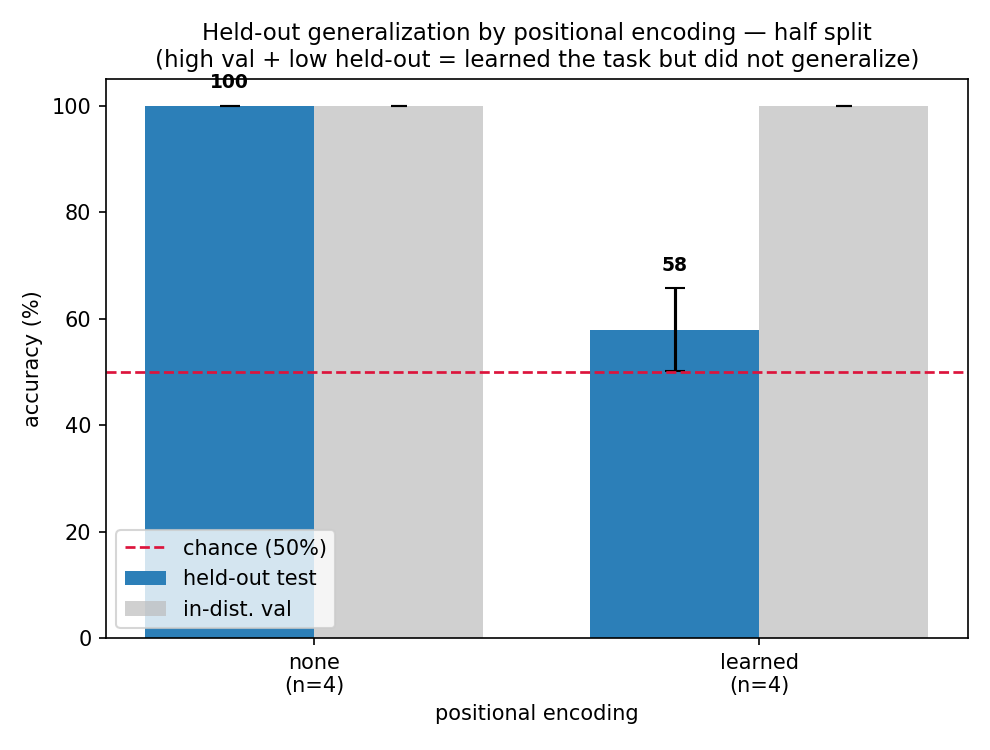
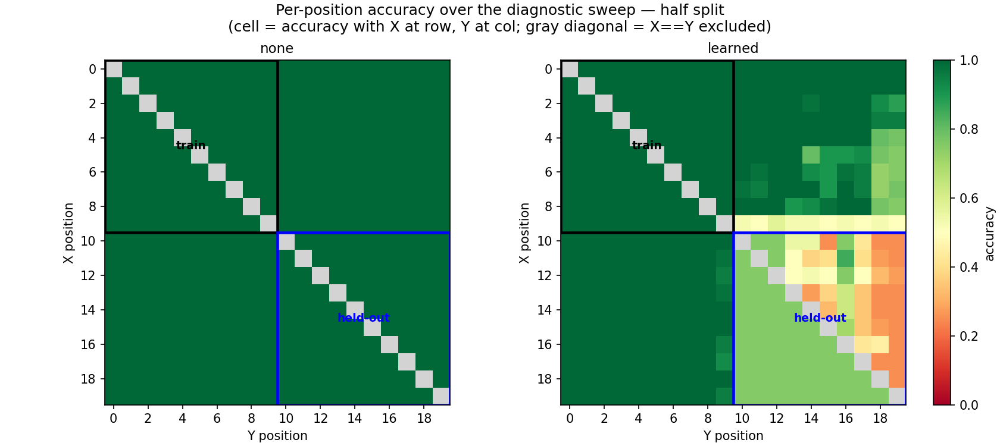

# Relative-Order Task — held-out positions (the phenomenon)

*2026-06-20 · commit `8213fcd` · John Lee*

> **Bottom line.** Tested at symbol positions **never seen in training** (second half of the
> string), `none` (no positional encoding) still scores **~100%**, while `learned` (absolute PE)
> **collapses to ~58%** — barely above chance — even though *both* hit 100% on in-distribution
> validation. **Removing positional encoding *helps* generalization here**, the opposite of the
> naive guess. (The full 5-way PE sweep that follows is in
> [2026-06-20-relative-order-pe-sweep.md](2026-06-20-relative-order-pe-sweep.md).)

### The task

Length-20 string with **one `X`** and **one `Y`** (rest are random digits). Output the last token:

```
T  if  X is before Y        ...X...Y...  : T
F  if  Y is before X        ...Y...X...  : F      rule (fixed): T ⇔ index(X) < index(Y)
```

The two settings compared: **`none` = NoPE** (no positional encoding) · **`learned` = APE**
(learned absolute position embedding).

---

## Setup

- **data / splits:** on the full distribution both settings scored 100% (previous log), so we
  restrict **where** `X`/`Y` may appear and test on positions never trained. Two held-out splits:

  | split | train / val sees | test = held out (never trained) |
  |-------|------------------|---------------------------------|
  | `single_pos` (P=12) | `X`,`Y` never at position 12 | exactly one of `X`/`Y` at position 12 |
  | `half` | both `X`,`Y` in the **first** half (0–9) | both `X`,`Y` in the **second** half (10–19) |

  Every pool is 50/50 T/F (chance = 50%); `prepare.py` asserts both the label rule and the split
  rule on every example before writing data — all passed.
- **model / config:** ~0.8M params (n_layer 4, n_head 4, n_embd 128), CPU, 2000 iters, AdamW
  lr 1e-3, batch 64, answer-token-only loss (the loss looks only at the final T/F token, not the digits).
- **seeds:** `single_pos` one seed (1337; already 100%); `half` 4 seeds (1337–1340), which vary
  **model init / batch order only** (one fixed data split — see Caveats).
- **env:** python 3.9.6 · torch 2.8.0 · numpy 2.0.2 · matplotlib 3.9.4 · data `SEED=1337`.
- **reproduce** (from `generalization-order/`):
  ```bash
  # set SPLIT in data/order/prepare.py: 'single_pos' (P=12) or 'half'
  ../venv/bin/python data/order/prepare.py
  for s in 1337 1338 1339 1340; do
    for pe in none learned; do
      ../venv/bin/python train.py    config/basic.py --pos_type=$pe --seed=$s
      ../venv/bin/python evaluate.py config/basic.py --pos_type=$pe --seed=$s   # appends results.csv
    done
  done
  ../venv/bin/python plot.py --split=half --methods=none,learned --out_dir=log/figures
  ```

---

## Results

Both settings behave **identically** until the hard split, where `learned` breaks:

| split | `none` held-out | `learned` held-out |
|-------|-----------------|--------------------|
| full distribution (baseline) | 100% | 100% |
| `single_pos` (hold out 1 position) | 100% | 100% |
| **`half` (hold out 2nd half)** | **≈100%** | **≈58%** ← breaks |

A single held-out position generalizes trivially (same as detection); only the **`half`** split
separates the methods. Per model-init seed on `half` (held-out test accuracy):

| seed | `none` | `learned` (per-class T / F) |
|------|--------|------------------------------|
| 1337 | 100%   | 69%  (T 38% / F 100%) |
| 1338 | 99.9%  | 50%  (T 100% / F 0%) |
| 1339 | 100%   | 61.5% (T 23% / F 100%) |
| 1340 | 100%   | 51.25% (T 2.5% / F 100%) |
| **mean** | **≈100%** | **≈58%** |
| in-dist **val** | 100% (all) | 100% (all) |

Read off (*val* = accuracy on trained positions; *test* = accuracy on the held-out positions):
1. **Both learn the task** (val = 100%); only `none` **generalizes** to the held-out positions.
2. **`learned` collapses to one label** — its T/F columns are near 0/100 or 100/0, and *which*
   label it defaults to flips by seed. So ~58% is a collapse, not a clean 50%. Representative
   (seed 1337): `learned` test `T 38% / F 100% → 69%`, and every error is a case whose correct
   answer is `T` but predicted `F`, with `X`,`Y` both in the 2nd half.

**Figures** (from `results.csv` / `predictions.csv` via `plot.py`, committed under [`figures/`](figures/)):

**1 — Held-out accuracy.** `none` at 100%, `learned` near the chance line; both val bars at 100%, so
the gap is a *generalization* failure, not a training failure.



**2 — Per-position accuracy.** Cell = accuracy with `X` at that row, `Y` at that column.
`none` is green everywhere. `learned` is green in the trained block (top-left) but in the held-out
block (bottom-right) it **fails wherever the answer is `T`** (red upper triangle) while still
getting `F` cases — off the trained region it stops distinguishing order and falls back to one label.



---

## Why

- **`none` (NoPE)** can only use the causal mask's *relative* order — "have I passed an `X` before
  reaching `Y`?" That rule doesn't depend on absolute position, so what it learned on the first half
  works unchanged on the second. → generalizes.
- **`learned` (APE)** *does* have trained position vectors for positions 10–19 (digits sit there in
  training), but it appears to tie the order computation to the **absolute positions where `X`/`Y`
  appeared** — the first half. On the held-out positions it misfires and defaults to one label. → chance.
- This last point is a **hypothesis** from the behavior + heatmap, not yet proven; Phase 7
  interpretability is what would confirm it.

## Caveats / limitations

- **The 4 seeds vary model init / batch order only, on one fixed data split** (seed-1337 data). So
  the spread reflects initialization noise, not data-sampling noise, and understates true variance.
  The gap (100 vs 58) dwarfs that noise, so the conclusion holds — but the stronger check is to
  regenerate the split per seed (see *Next*).
- `single_pos` ran one seed only — both methods are already at 100%, so a multi-seed sweep would
  add nothing.

## Relation to prior work

Reproduces the NoPE-vs-absolute-PE finding of **Kazemnejad et al. (2023)**, *The Impact of
Positional Encoding on Length Generalization in Transformers* (NeurIPS 2023; abstract verified) —
they show it for **length generalization** (longer sequences); here it appears in a **fixed-length,
held-out-position** setting (the shift is over *where* a symbol sits, not over length).

## Next

1. **Full PE sweep** — does the relative/absolute distinction hold for `sinusoidal`, `rope`, `t5`?
   → [2026-06-20-relative-order-pe-sweep.md](2026-06-20-relative-order-pe-sweep.md).
2. **Strengthen the sweep** — regenerate the data split per seed (data-sampling variance).
3. **Phase 7 interpretability** — test the absolute-position-reliance story directly.
