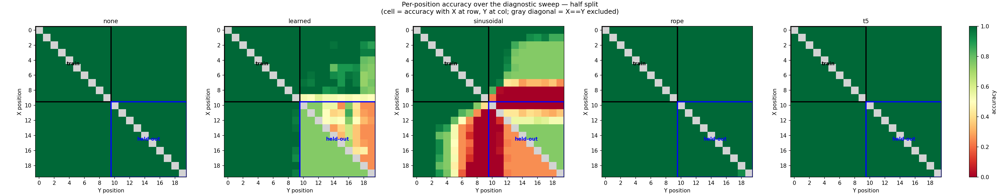

# Relative-Order Task — the positional-encoding sweep (Phase 3)

*2026-06-20 · commit `f6642dc` (+ uncommitted Phase-3 edits — commit to pin) · John Lee*

> **Bottom line.** Extending the [held-out experiment](2026-06-20-relative-order-heldout-splits.md)
> from 2 encodings to all 5: on held-out positions, the **relative** family — `none` (causal
> mask), `rope`, `t5` — generalizes at **~100%**, while the **absolute** family — `learned`,
> `sinusoidal` — collapses to chance or below (**~58%**, **~33%**). All five reach **100%
> in-distribution val**, so the gap is *generalization*, not learning. **Whether a method encodes
> position relatively or absolutely cleanly predicts whether it generalizes here.**

### The task & question

Same task and `half` split as the held-out log (length-20, one `X` + one `Y`, output `T` iff
index(X) < index(Y); train both symbols in the first half 0–9, test both in the second half 10–19;
50/50 T/F, chance = 50%). Question: the previous log showed `none` generalizes but `learned`
collapses — does that split go by **PE family**? The five encodings:

- **relative:** `none` = NoPE (order leaks from the causal mask) · `rope` = rotary · `t5` = relative bias
- **absolute:** `learned` = learned absolute embedding (APE) · `sinusoidal` = fixed Vaswani-2017 table

---

## Setup

- **What was built:** filled in the three stubbed encodings in `pos_encoding.py` (engine otherwise
  unchanged; `pos_type` stays the only independent variable):

  | PE | branch | implementation |
  |----|--------|----------------|
  | `sinusoidal` | A: add to embedding | fixed sin/cos table (Vaswani 2017) |
  | `rope` | B: rotate q,k | rotary, standard rotate-by-halves (`q·k` depends only on the offset) |
  | `t5` | C: attention bias | unidirectional bucketed relative bias, `nn.Embedding(num_buckets, n_head)` |

- **Integrity (smoke test, no training):** all five build; forward returns `(8, 22, 16)` logits,
  finite; causal masking holds (changing the last token leaves earlier positions' logits
  unchanged); params ~0.8M each (`sinusoidal`/`rope` add 0, `t5` adds 32×4).
- **model / config:** ~0.8M params (n_layer 4, n_head 4, n_embd 128), CPU, 2000 iters, AdamW
  lr 1e-3, batch 64, answer-token-only loss (the loss looks only at the final T/F token, not the digits).
  **seeds:** 4 (1337–1340), which vary model initialization and batch order only (one fixed data
  split — see Caveats).
- **env:** python 3.9.6 · torch 2.8.0 · numpy 2.0.2 · matplotlib 3.9.4 · data `SEED=1337`.
- **reproduce** (from `generalization-order/`, `half` split on disk):
  ```bash
  # set SPLIT='half' in data/order/prepare.py, then
  ../venv/bin/python data/order/prepare.py
  for pe in none learned sinusoidal rope t5; do
    for s in 1337 1338 1339 1340; do
      ../venv/bin/python train.py    config/basic.py --pos_type=$pe --seed=$s
      ../venv/bin/python evaluate.py config/basic.py --pos_type=$pe --seed=$s   # appends results.csv / predictions.csv
    done
  done
  ../venv/bin/python plot.py --split=half --out_dir=log/figures                  # 5-way figures
  ```

---

## Results — `half` split, 4 seeds each

| PE | family | in-dist val | held-out test |
|----|--------|-------------|---------------|
| `none` | relative (causal mask) | 100% | **≈100%** |
| `rope` | relative | 100% | **≈100%** |
| `t5` | relative | 100% | **100%** |
| `learned` | absolute | 100% | **≈58%** |
| `sinusoidal` | absolute | 100% | **≈33%** |

(*val* = accuracy on trained positions; *test* = accuracy on the held-out positions.) All five
**learn the task** (val 100%); only the **relative** family **generalizes**. The absolute
family collapses to (mostly) one label — `learned` to ~chance, `sinusoidal` even **below** chance
(it learned a position-tied rule that is actively wrong in the second half). Per seed (held-out test):

| seed | `none` | `rope` | `t5` | `learned` | `sinusoidal` |
|------|--------|--------|------|-----------|--------------|
| 1337 | 100%  | 99.7%  | 100% | 69%   | 30.6% |
| 1338 | 99.9% | 99.75% | 100% | 50%   | 39.95% |
| 1339 | 100%  | 100%   | 100% | 61.5% | 24.7% |
| 1340 | 100%  | 100%   | 100% | 51.25%| 35.6% |
| **mean** | **≈100%** | **≈99.9%** | **100%** | **≈58%** | **≈33%** |

**Figures** (from `results.csv` / `predictions.csv` via `plot.py`, committed under [`figures/`](figures/)):

**1 — Held-out accuracy by method.** The three relative methods sit at 100%; the
two absolute methods sit at/below the chance line. Every in-distribution val bar is 100%, so each
gap is a *generalization* failure, not a training failure.


**2 — Per-position accuracy.** Cell = accuracy with `X` at that row, `Y` at that column.
`none`, `rope`, `t5` are green everywhere. `learned` and `sinusoidal` are green in the trained block
(top-left) but break in the held-out block (bottom-right) — `sinusoidal` worst, going deep red
(below chance) where the answer is `T`.



---

## Why

- **Relative methods (`none`, `rope`, `t5`)** express the answer through *relative* offsets between
  positions — `none` via the causal mask ("have I passed an `X` before reaching `Y`?"), `rope` via
  rotation that makes `q·k` depend only on the offset, `t5` via a bias on the relative distance.
  A relative rule learned on the first half applies unchanged in the second half. → generalizes.
- **Absolute methods (`learned`, `sinusoidal`)** tie the computation to the *absolute* positions
  seen in training (0–9). On the held-out positions (10–19) those features don't carry the learned
  meaning, so the model misfires and falls back to one label — `sinusoidal`'s fixed table even flips
  it below chance. → fails.
- This mechanism (absolute-feature reliance) is consistent with the figures but is still a
  **hypothesis**; Phase 7 interpretability is what would confirm it directly.

## Caveats / limitations

- **The 4 seeds vary model init / batch order only, on one fixed data split** (seed-1337 data) — so
  the spread is initialization noise, not data-sampling noise, and understates true variance. The
  family separation (relative ~100% vs absolute ≤58%) dwarfs that noise, so the conclusion holds;
  the stronger check is to regenerate the split per seed (see *Next*).

## Relation to prior work

Reproduces — across a whole family — the NoPE-vs-absolute-PE finding of **Kazemnejad et al. (2023)**,
*The Impact of Positional Encoding on Length Generalization in Transformers* (NeurIPS 2023; abstract
verified). They report it for **length generalization** (longer sequences); here the
relative-vs-absolute split appears in a **fixed-length, held-out-position** setting — the shift is
over *where* a symbol sits within a fixed length, not over length. That fixed-length angle is the
contribution.

## Next

1. **Strengthen the sweep** — regenerate the data split per seed so error bars include
   data-sampling variance.
2. **More splits** — even/odd and distance-based hold-outs, to test whether the relative/absolute
   line holds across generalization axes.
3. **Phase 4 — minimal model** — shrink layers/heads and re-check the separation.
4. **Phase 7 interpretability** — test the absolute-feature-reliance story directly.
