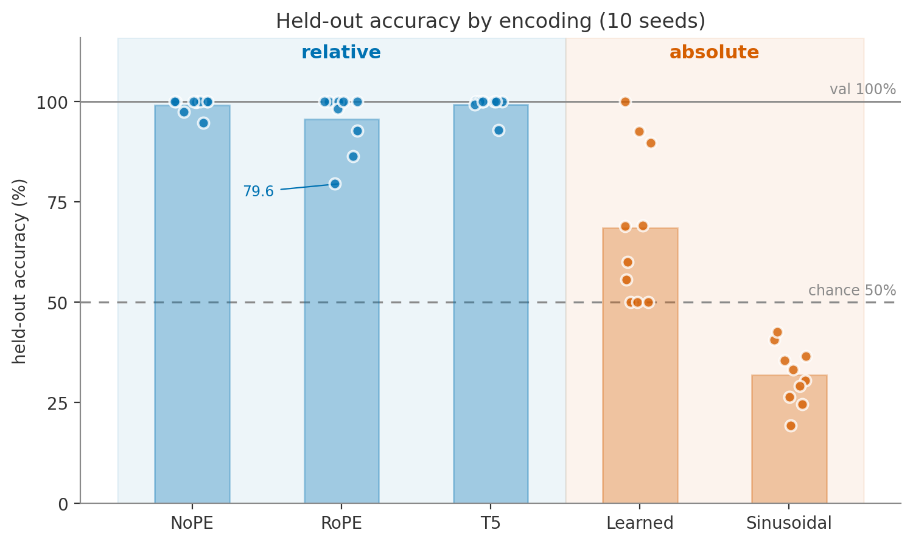
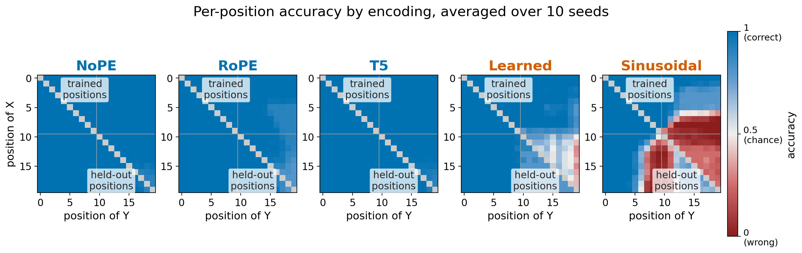

# Relative-Order PE Sweep — 10-seed run

*2026-07-13 · John Lee*

> **TL;DR.** Re-ran the [Phase 3 sweep](2026-06-20-relative-order-pe-sweep.md) with 10 seeds
> (was 4), each **regenerating its own data split**. The relative-vs-absolute split still holds
> on average, but the stronger run shows variance the 4-seed run hid: **RoPE isn't a clean
> 100%** (95.7, one seed 79.6), and **`learned` sometimes generalizes fully** (mean 68.6, but
> per-seed it's either ~50 or ~90+). All five still hit **100% val**.

## Setup

- **Task / split:** same as before — length-20, one `X` + one `Y`, output `T` iff index(X) < index(Y).
  `half` split: train both symbols in 0–9, test both in 10–19. Chance = 50%.
- **The one change:** each seed regenerates the train/val/test split (env `DATA_SEED`), so the
  spread now reflects **data-sampling variance**, not just init/batch-order noise. The 4-seed run
  used one fixed split (`SEED=1337`) and understated variance — its own caveat.
- **Model:** unchanged (~0.8M: 4 layers, 4 heads, 128 dim, block 64, causal, CPU, 2000 iters,
  AdamW 1e-3, batch 64, answer-token-only loss). 10 seeds (1337–1346).
- **Reproduce:** `bash run_multiseed.sh` → `results_multiseed.csv` / `predictions_multiseed.csv`.
- **Sanity check:** seed 1337 (same data seed as the old run) reproduced the published values exactly.

## Results — held-out accuracy, mean ± std over 10 seeds

| PE | family | val | **held-out** | range |
|----|--------|-----|--------------|-------|
| `none` (NoPE) | relative | 100% | **99.2 ± 1.7** | 94.7–100 |
| `t5`   | relative | 100% | **99.2 ± 2.1** | 92.9–100 |
| `rope` | relative | 100% | **95.7 ± 6.8** | **79.6**–100 |
| `learned` | absolute | 100% | **68.6 ± 18.1** | **50–100** |
| `sinusoidal` | absolute | 100% | **31.9 ± 6.9** | 19.2–42.7 |

Per seed:

| seed | NoPE | RoPE | T5 | Learned | Sinusoidal |
|------|------|------|----|---------|------------|
| 1337 | 100.0 |  99.7 | 100.0 |  69.0 | 30.6 |
| 1338 |  97.5 |  92.8 | 100.0 |  50.0 | 26.4 |
| 1339 | 100.0 | 100.0 | 100.0 |  89.7 | 36.6 |
| 1340 | 100.0 | 100.0 | 100.0 |  69.1 | 40.6 |
| 1341 |  94.7 |  79.6 | 100.0 | 100.0 | 33.2 |
| 1342 | 100.0 | 100.0 |  92.9 |  50.0 | 35.4 |
| 1343 | 100.0 |  86.5 | 100.0 |  92.7 | 29.1 |
| 1344 | 100.0 |  98.3 |  99.3 |  60.0 | 42.7 |
| 1345 | 100.0 | 100.0 | 100.0 |  50.0 | 24.6 |
| 1346 | 100.0 | 100.0 | 100.0 |  55.6 | 19.2 |

## Figures

**Figure 1 — held-out accuracy.** Mean bars + all 10 seed points (a box plot misleads at n=10).
`learned` straddles chance with a **bimodal** spread — its 68.6 bar is a value no seed produced.
RoPE's one low seed (79.6) is labelled.

**Figure 2 — per-position accuracy (10-seed mean).** Cell = accuracy with `X` at the row, `Y` at
the column; grey diagonal (x=y) excluded. Relative = all correct; absolute = correct in the train
block (top-left), broken in the held-out block (bottom-right). Blue = correct, red = below chance.
(`sinusoidal`'s triangular pattern is **label collapse**, not distance reading — don't over-read it.)

## Takeaways

- **The headline holds:** relative (96–99) beats absolute (32–69) by far more than the seed noise,
  so "relative predicts generalization" is safe.
- **But it's not a clean binary per seed** — the 4-seed "clean split" was partly one lucky split.
  RoPE is the shakiest relative method; `learned` is all-or-nothing.
- **The two absolute PEs fail for different reasons.** `sinusoidal`'s held-out position vectors are
  **fixed** → no usable signal → consistently below chance. `learned`'s held-out vectors **do** get
  trained (the filler digits sit there in every example, just never `X`/`Y`) → sometimes useful,
  sometimes not → the huge variance. Kazemnejad et al. (2023) can't see this: in their length
  setting the held-out positions never exist during training.

## Caveats

- 10 seeds pin down the **family gap**, not `learned`'s mean (std 18 → SEM ≈ 5.7). Its occasional
  full generalization is a qualitative note, not a rate (that needs ~30+ seeds).
- One task, one split, one length. The mechanism above fits the data but isn't directly verified.

## Next

- Report figures regenerated from the 10-seed data (done; the old 4-seed PNGs no longer match).
- Optional: more seeds on the two absolute conditions to tighten their error bars.
